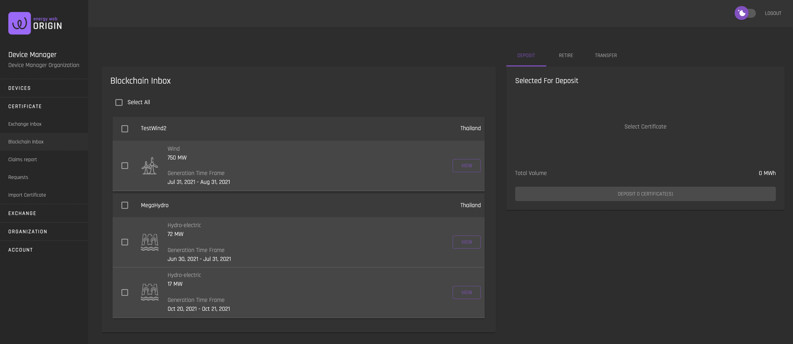
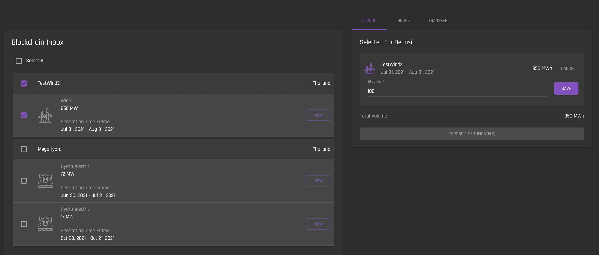
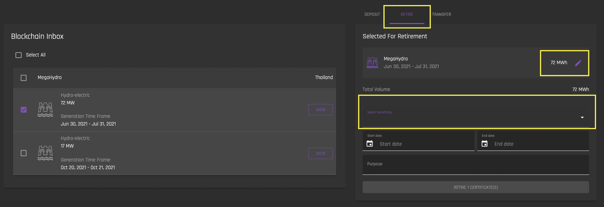
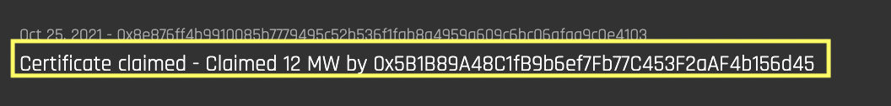
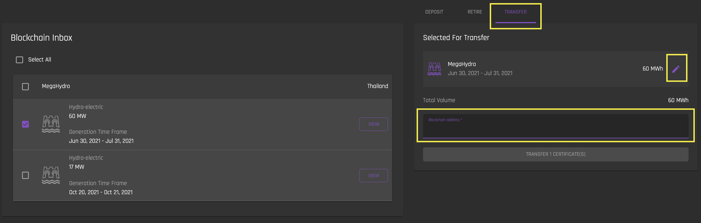

# Blockchain Inbox 
[**UI Components**](https://github.com/energywebfoundation/origin/tree/master/packages/ui/libs/certificate/view/src/pages/BlockchainInboxPage)

The Blockchain Inbox interface shows all certificates for your organization’s devices that are currently in your Organization’s Blockchain Inbox. This inbox is associated with your [Organization's Blockchain Account Address](../user-guide-reg-onboarding.md#organization's-blockchain-account-address).  

* Note that your Organization must have a registered Blockchain Address, and your MetaMask must be connected in order to view the Blockchain Inbox interface. You can see guidance on this [here](../user-guide-reg-onboarding.md#blockchain-addresses). 

 Certificates in this inbox are not active on the exchange. Certificates must be in the Blockchain Inbox in order to be:  

1. Deposited onto the exchange (at which point they are in [Exchange Inbox](./exchange-inbox.md), in the custody of the platform administrator's [Exchange wallet](../user-guide-glossary.md#exchange-wallet) and can be posted for sale)
2. Retired for sustainability reporting
3. Transferred to another blockchain account address 

## Deposit

To deposit Certificate Mwh onto the Exchange, select the device and navigate to the Deposit tab. Once deposited, these Mwh can be active on the exchange and will be visible in your [Exchange Inbox](./exchange-inbox.md). 

Note that you can edit the number of Mwh you would like to deposit by clicking the pencil icon next to the Mwh. By default, the number of Mwh to deposit is the total number of Mwh available from the certificate.  

When you click ‘Deposit Certificate’, you will need to confirm the transaction in MetaMask. Once the transaction is complete, you will see those Mwh removed from your device list in your Blockchain Inbox and added to your device list in the [Exchange Inbox](./exchange-inbox.md).

## Retire

Mwh from certificates are retired when you would like to use them for sustainability reporting, and keep them permanently in your Organization's Blockchain account. 

Once hours are retired, they will no longer be visible in your Blockchain Inbox. They are permanently locked in place in your Organization's Blockchain account and cannot be revoked by the issuer, transferred or placed back on the Exchange. 

**If you would like to keep retired certificates in the custody of the Exchange operator (in the [Exchange Wallet](../user-guide-glossary.md#exchange-wallet)), you must first [deposit the certificate onto the Exchange](#deposit), and then [use the Exchange Inbox's "Claim" function](./exchange-inbox.md#claim)**. If you retire a certificate using the Exchange Inbox's "Claim" function, you cannot select a Beneficiary for the certificate, as your Organization will automatically be designated as beneficiary. 

To retire Mwh, select the certificate you would like to retire and navigate to the Retire tab. 

Note that you must select a beneficiary for the retired Mwh. Admin users can add beneficiaries in the [Create Beneficiaries](../organization-guides/create-beneficiary.md) interface. Once a beneficiary is added, they will show up in the 'Select Beneficiary' dropdown in the Retire tab.   

The ‘Start Date’ and ‘End Date’ is the window for sustainability reporting these hours will contribute towards. 

You can edit the number of Mwh you would like to retire from a certificate by clicking the pencil icon next to the Mwh. By default, the number of Mwh to retire is the total number of Mwh currently available from the certificate(s). 

Once you are satisfied with the number of Mwh to retire and have selected a beneficiary and a ‘start’ and ‘end’ date for reporting time period, Click 'Retire Certificate'. You will need to approve this transaction in MetaMask. If the transaction is successful, the retired hours will be deducted from your Blockchain Inbox and will appear in the [Claims Report](./claims-report.md) interface. 

**Note that once the data for retiring a certificate is submitted, it cannot be edited.** 

You can view retired certificate hours in the [Claims Report interface](./claims-report.md). Click on any claim to see claim details. 

The address in the above "Certificate Claimed" claim detail is the public address of the Organization's Blockchain account that is displayed in the [User Profile settings](../user-guide-reg-onboarding.md#organization-blockchain-account-address). This indicates that the certificate is retired and resides in the Organization's blockchain account.  

## Transfer

A user can transfer certificate hours to another blockchain account by using the Transfer function. 

To transfer Mwh, select the certificate you would like to retire and navigate to the Transfer tab. 

