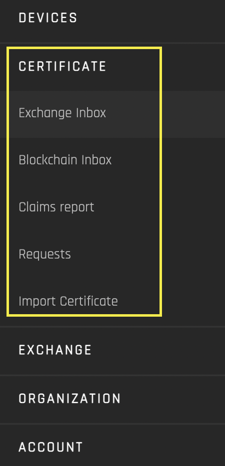

# Certificate
- [**UI Components**](https://github.com/energywebfoundation/origin/tree/master/packages/ui/libs/certificate)

The Certificate interface allows you to manage your certificates and view certificate requests. 

The interface has five views:  

1. **[Exchange Inbox:](./exchange-inbox.md)** Manage certificates that are currently active on the exchange
2. **[Blockchain Inbox:](./blockchain-inbox.md)**  Manage certificates that in the organization blockchain account (certificates that are not currently active on the exchange)
3. **[Claims Report:](./claims-report.md)** View certificate hours that have been retired from the exchange and claimed for sustainability reporting
4. **[Requests:](./requests.md)** View all pending and approved certificate requests
5. **[Import Certificate:](./import-certificate.md)** Import I-REC certificates into the Origin platform

