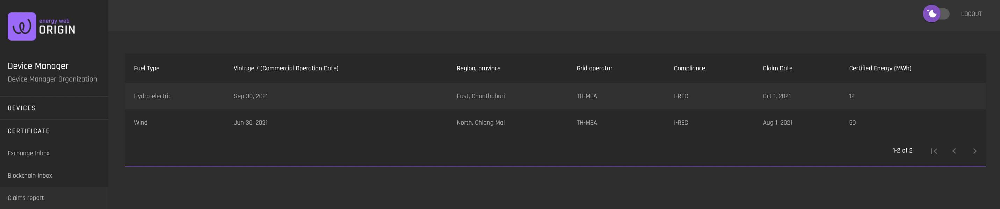
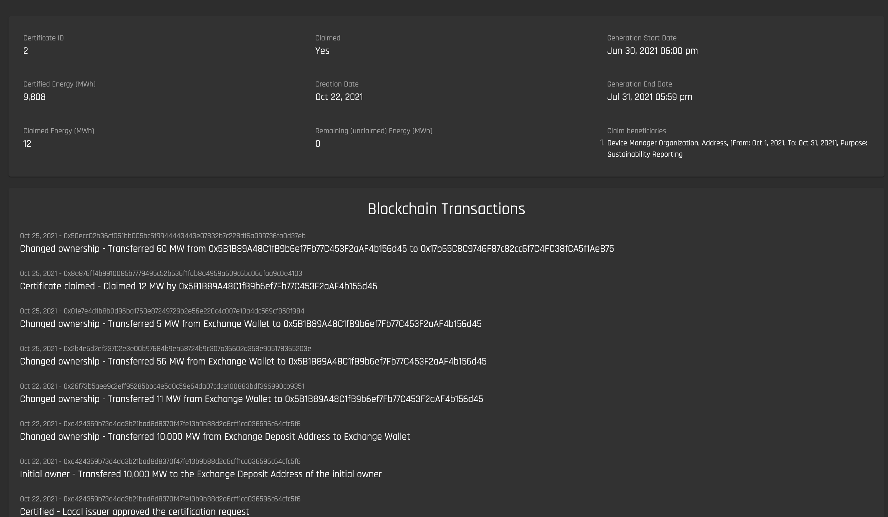

# Claims Report
[**UI Components**](https://github.com/energywebfoundation/origin/tree/master/packages/ui/libs/certificate/view/src/pages/ClaimsReportPage)

The Claims Report interface allows admin users to see all certificate hours from the organization’s generating devices that have been retired from the exchange and claimed for sustainability reporting. 

  

To view the details for each claim, click the row. You will be navigated to the certificate details for that claim including:
- The certificate ID
- Total MWh generated for the certificate
- Claimed Mwh
- Remaining unclaimed Mwh from the certificate
- ‘Claimed’ status
- Creation Date
- Generation Start Date
- Generation End Date
- Claim beneficiaries
- Blockchain Transaction History for certificate’s Mwh

