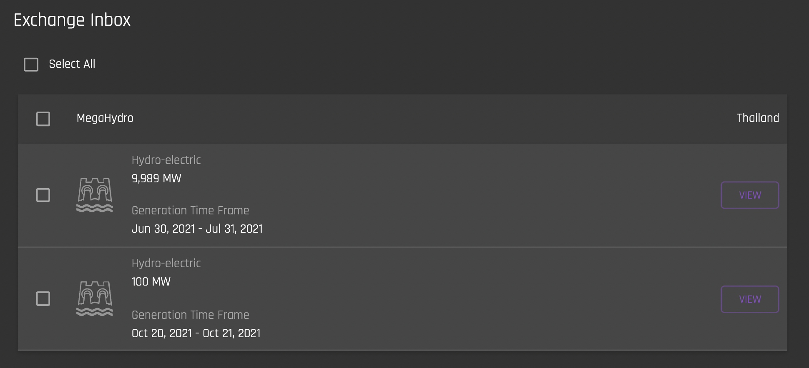
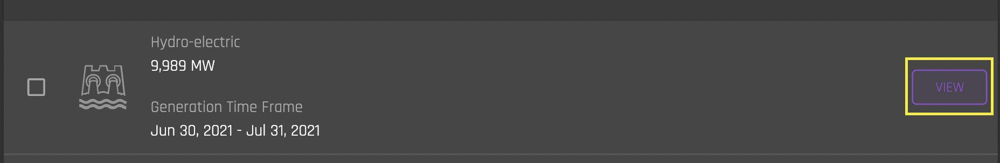
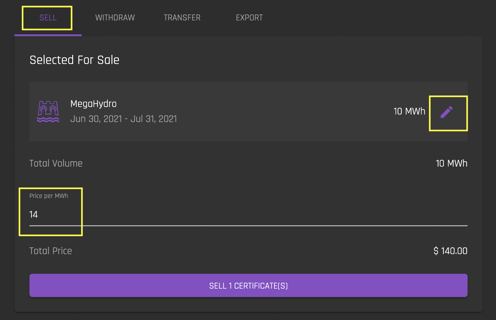
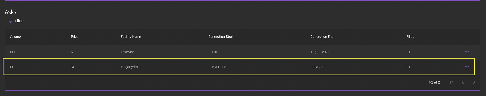
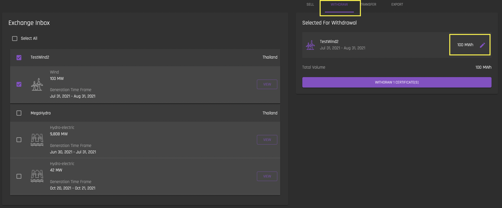
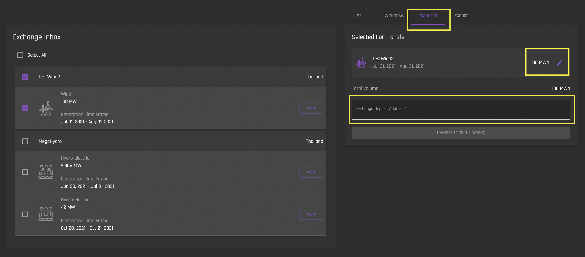
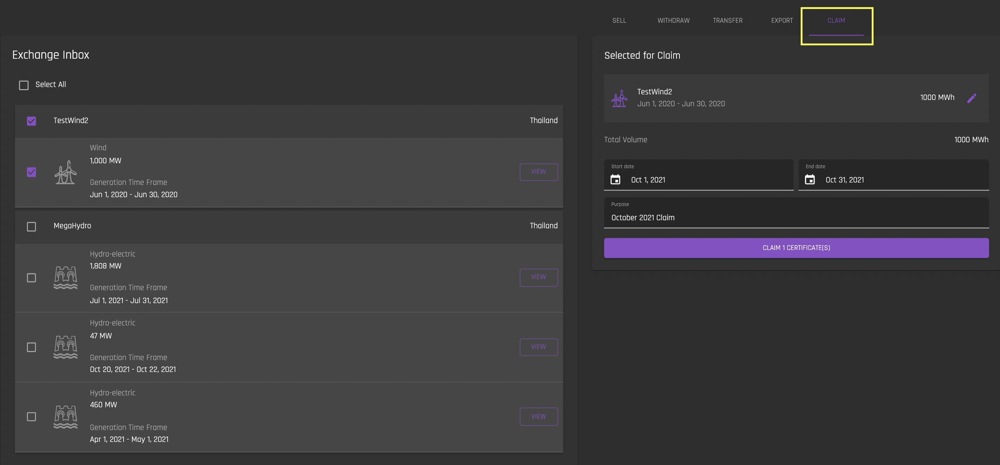
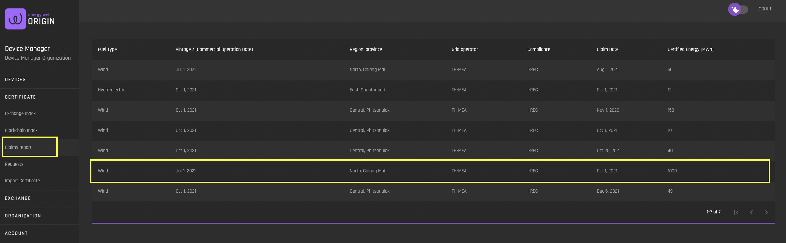
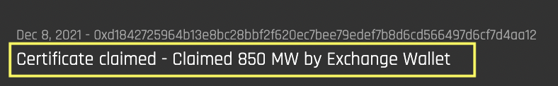

# Exchange Inbox 
[**UI Components**](https://github.com/energywebfoundation/origin/tree/master/packages/ui/libs/certificate/view/src/pages/ExchangeInboxPage)

The Exchange Inbox shows all of your organization's certificates that are currently on the Exchange. The Exchange Inbox allows admin users to [sell](#sell), [withdraw](#withdraw), [transfer](#transfer), [export](#export) and [claim ](#claim) certificates that are currently on the Exchange. Certificates in this inbox are held in the [Exchange wallet](../user-guide-glossary.md#exchange-wallet).  

**When the issuing body approves a certificate request, the certificate is immediatley deposited into the Exchange Inbox (unless the user has selected the ["Full Self-Ownership" toggle](../user-guide-reg-onboarding.md#full-self-Ownership) in the User Profile settings, in which case the certificate is deposited into the [Blockchain Inbox](./blockchain-inbox.md)).**  

Certificates must be in the Exchange Inbox in order to be:  

1. Posted for sale
2. Transferred to another exchange deposit address
3. Transferred to the [Blockchain Inbox](./blockchain-inbox.md)
4. Exported to an I-REC account. 

If you want to move certificate hours from this inbox into your organization’s [Blockchain Inbox](./blockchain-inbox.md), you must use the [Withdraw](#withdraw) tab on this interface. 

  

Certificate hours in your Exchange Deposit address are active on the Exchange and can be sold on the Exchange using the [Sell tab](#sell).

## View Certificate Details
[**UI Components**](https://github.com/energywebfoundation/origin/tree/master/packages/ui/libs/certificate/view/src/pages/DetailViewPage)

You can view a certificate’s details by clicking on ‘View’:

## Sell 

To put generated Mwh on the exchange for sale, select the certificate that you want to sell and navigate to the Sell tab. Set a price per Mwh. 

Note that by default, all of the Mwh that the certificate represents will be for sale. You can edit the amount of Mwh that you want to sell by clicking on the edit icon and entering in the desired number. 

When you are satisfied with the price and number of Mwh to sell, click ‘Sell Certificate’. This will create an [ask](../user-guide-glossary.md#ask) on the exchange:

  

Once a Certificate is posted for sale, it is "locked" and cannot be withdrawn or transferred. In order to unlock the Certificate, you must first cancel the ask. 

## Withdraw

To withdraw certificates from the exchange to your organization’s Blockchain Inbox account, select the certificate you want to withdraw and navigate to the Withdraw tab.  

Note that by default, all of the Mwh that the certificate represents will be up for withdrawal. You can edit the amount of Mwh that you want to withdraw by clicking on the edit icon and entering in the desired number.   

Once you withdraw the Mwh, they  will be transferred to your [Blockchain Inbox](./blockchain-inbox.md) under the generation device.

## Transfer

Mwh from certificates can be transferred to another Exchange Deposit address (the public address associated with another Exchange Deposit account) if you would like to perform a transfer or a sale outside of the Exchange interface. To transfer Mwh from a certificate to another Exchange inbox account, select the certificate that you would like to transfer and navigate to the Transfer tab. 

Note that you can edit the number of Mwh you would like to transfer by clicking the pencil icon next to the Mwh. By default, the number of Mwh to transfer is the total number of Mwh available from the certificate. 

Enter the exchange deposit address and click “Transfer Certificate”. 

## Claim

Mwh from certificates are claimed when you would like to use them for sustainability reporting, and keep them permanently in the Exchange wallet. Once hours are claimed, they will no longer be visible in your Exchange Inbox. They are permanently locked in place in the Exchange wallet and cannot be revoked by the issuer, transferred or withdrawn from the Exchange wallet. Note that by using the Claim function, your Organization is automatically assigned as the beneficiary of the certificate in the Claim Data. 

If the user has not linked their blockchain account at the time they claim a certificate, claimed certificates will still be locked in the Exchange Inbox with the Organization assigned as the beneficiary of the certificate in the Claim Data. 

**If you would like to keep claimed certificates in your Organization's Blockchain account, or designate a beneficiary other than your organization for the certificate, you must first withdraw the certificate from the Exchange into your Blockchain inbox, and then [use the Blockchain Inbox's "Retire" function](./blockchain-inbox.md#retire)**. 

To claim certificates for reporting purposes, select the certificate you want to withdraw and navigate to the Claim tab. 

  

Note that you can edit the number of Mwh you would like to claim by clicking the pencil icon next to the Mwh. By default, the number of Mwh to claim is the total number of Mwh available from the certificate. 

Once the claim is processed, You can view claimed certificate hours in the [Claims Report interface](./claims-report.md). 

 

Click on the claim to see claim details. 

 

The address in the above "Certificate Claimed" claim detail is the address of the Exchange wallet. This indicates that the certificates has been retired from the Exchange inbox, and now resides permanantly in the Exchange wallet.  

