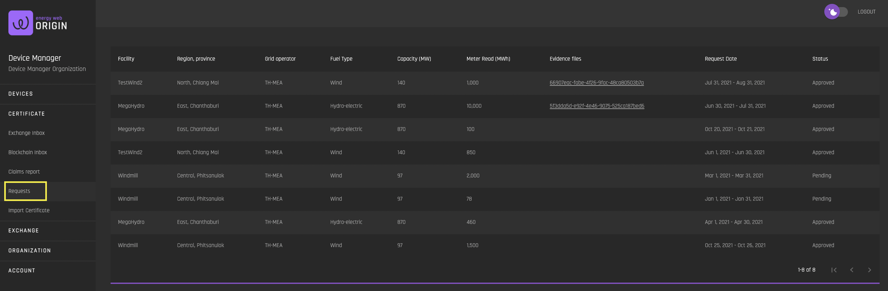

# Requests
[**UI Components**](https://github.com/energywebfoundation/origin/tree/master/packages/ui/libs/certificate/view/src/pages/RequestsPage)

The Requests interface allows admin users to view all of their organization’s pending and approved certificate requests. The request contains the generation data that the organization submitted to the issuing body at the time of request, as well as the certificate status, which can be ‘pending’, ‘approved’ or ‘rejected’.
