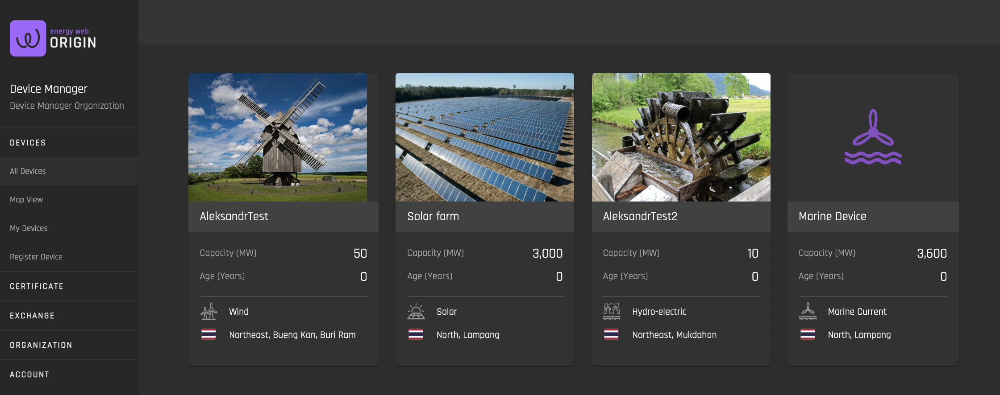
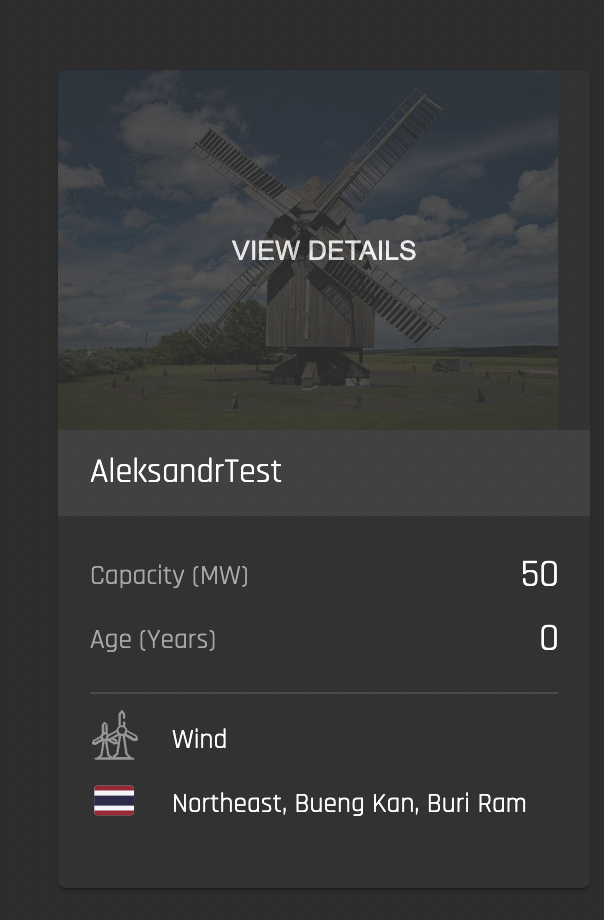
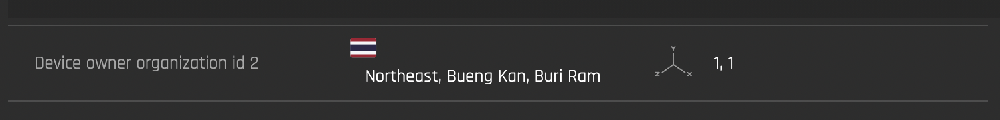
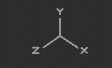
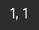
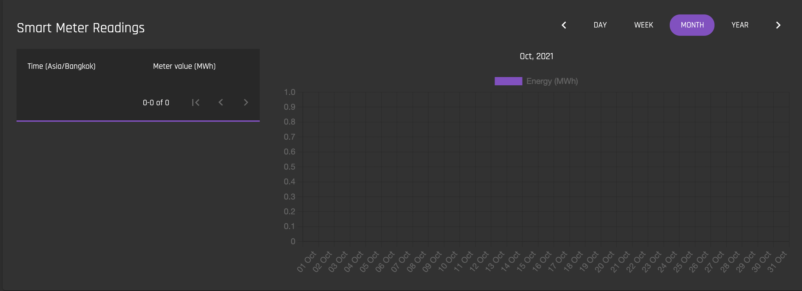

# All Devices
[**UI Components**](https://github.com/energywebfoundation/origin/tree/master/packages/ui/libs/device/view/src/pages/AllDevicesPage)

This view provides a tile view of all devices registered within a marketplace:

To view a device’s details, click the device image or image placeholder. If hovered over, you will see “View Details”:

## Device Detail View

This view provides high-level generation capacity, certification overview and smart meter readings for a single device. 

Device details fields are dependent on implementation needs. The following is an overview of the fields provided in the reference implementation:

### Reference Implementation Fields for Device Details

#### Device Overview 

|           Field           |                                           Data                                                               |
|:-------------------------:|:-------------------------------------------------------------------------------------------------------------------------------:|
| Certified MW              | MWh of generation already certified                                                                                             |
| Nameplate Capacity        | Maximum generation capacity in MW                                                                                               |
| Certified by Registry     | The registration body that issues the device’s Energy Attribute Certificate(s) (i.e. IREC)                                      |
| To Be Certified           | Generation in MWh Pending certification                                                                                         |
| Other green attributes    | For example, labels associated with the device like EKOenergy                                                                   |
| Public Support            | Any financial subsidies (e.g., feed-in-tariff) received by the generating asset from the government or other public institution |
| Commercial Operation Date | Date of first commercial operation                                                                                              |

<b>Device Owner and Location Details</b>

|      Field      |                     Data                    |
|:---------------:|:-------------------------------------------:|
| Device Owner    | Organization ID of device owner             |
| Device Location | Country flag indicator, region, city, state |
|      | Geographic coordinates of device            |
|         | Longitude, latitude of device               |

##### Smart Meter Readings

Use this interface to select a timeframe to view the device’s meter reading values in MWh.