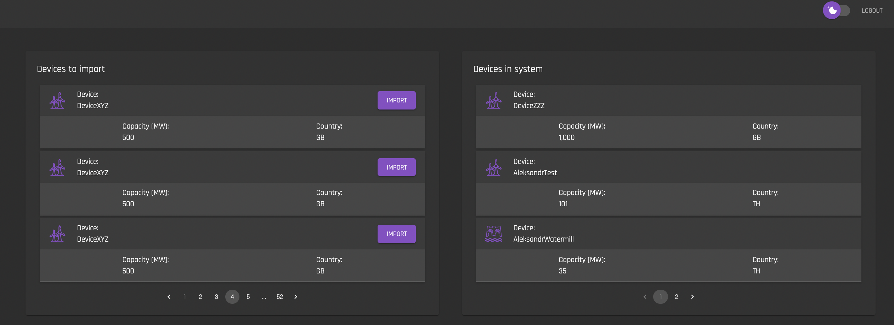
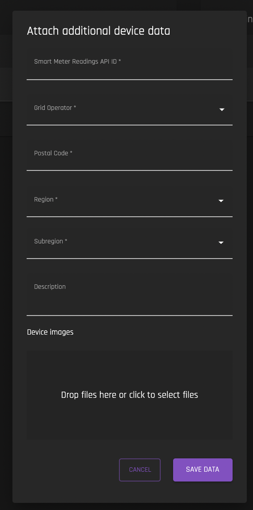

# Import Device
[**UI Components**](https://github.com/energywebfoundation/origin/tree/master/packages/ui/libs/device/view/src/pages/DeviceImportPage)

Use this interface to import your organization's devices that are currently registered with I-REC but are not registered on the Origin platform. **You must have a User Role of Admin or Device Manager to view this interface and import devices.**

You will need to add additional device data before importing the device to the Origin platform:

In order to view your I-REC registered devices, you must [Connect to I-REC using your I-REC API credentials](../organization-guides/connect-irec.md) (note that you must be an admin to do this). Once this connection is made, your devices to import will be automatically populated and you can import them into the Origin system. 