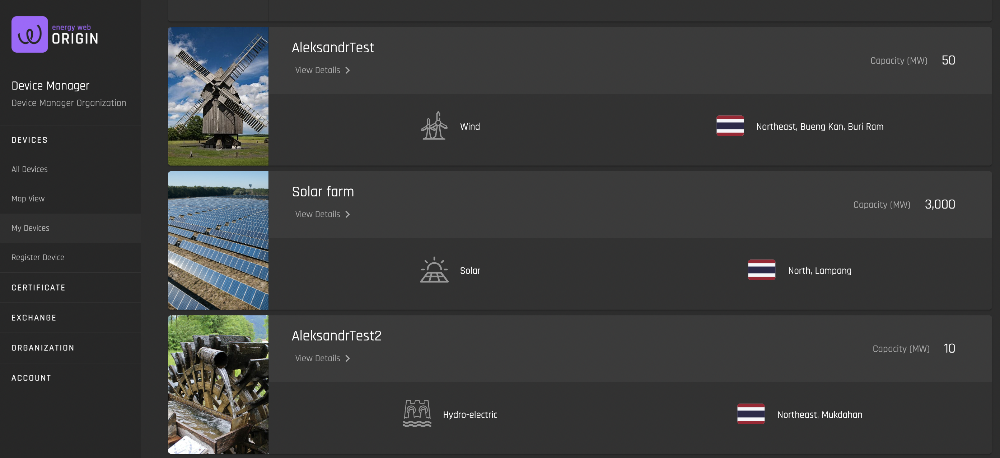
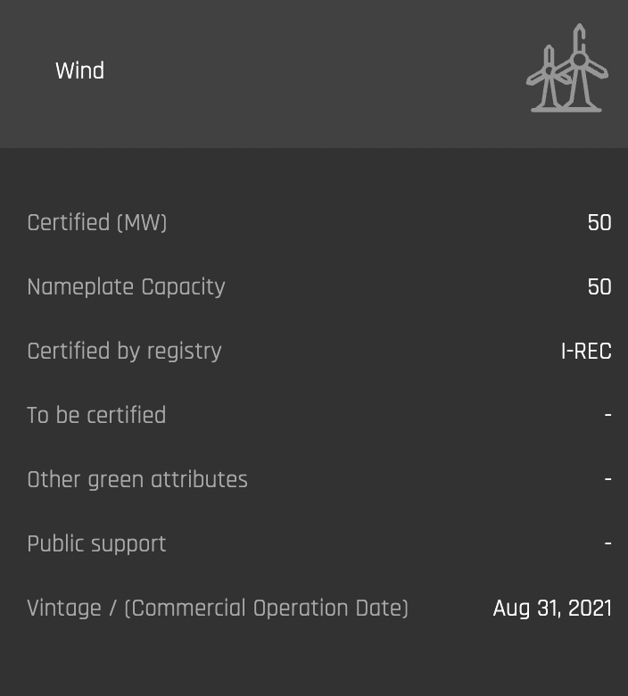
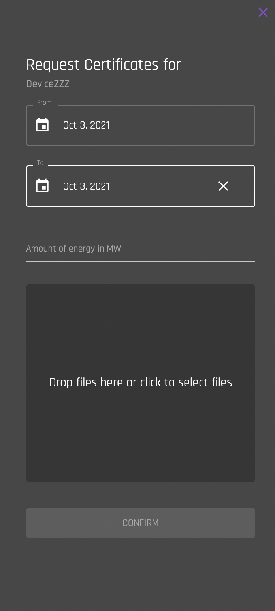
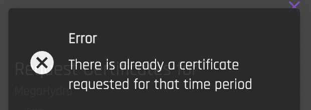

# My Devices
[**UI Components**](https://github.com/energywebfoundation/origin/tree/master/packages/ui/libs/device/view/src/pages/MyDevicesPage)

Use this interface to view all of your organization's registered devices.   

Click on **“View Details”** to view device details:  

**Click anywhere else on the device card to request certificates for the device**.

## Request Certification for Device
Once your device has been registered and approved, you can certify produced electricity for a given period of time with the I-REC Standard and request issuance of corresponding I-RECs.   

Users can request the issuance of certificates for a specific generation device within a specific time frame. They must provide the issuer with generation evidence from the device at the defined time. Based on this evidence, the energy volume can be determined and thereby the number of certificates (e.g. each 1 MWh) that is requested. A specific address can be defined to issue the certificates to. The default is the address that called the function.

<b>Monthly certification</b> is the most common practice in the market, however most standards allow for a daily granularity.

Requesting certificates for a specific generation device happens manually as most standards do not allow for SCADA data to be used as generation evidence. You are required to upload the official settlement document provided by the grid operator as generation evidence. The evidence must be provided for the right generation device and time frame to be approved.

Once submitted through the Origin platform, the local issuer receives the certification request, can verify the evidence and approve the request. The request is recorded as a blockchain transaction on-chain.

### Certificate Request Fields

|                   Field                |                               Data                                               |
|:----------------------------------------:|:------------------------------------------------------------------------------------------------:|
| From                                     | Select initial date for generation period                                                        |
| To                                       | Select last date for generation period                                                           |
| Amount of energy in MWh                  | Input MWh generated in time selected period                                                      |
| Drop files here or click to select files | Upload generation evidence (e.g., official settlement document(s) provided by the grid operator. |

**Note** that you can only request one certificate for a given time period. If you request a certificate for a time period in which you already have a pending or confirmed certificate request, you will receive an error message:

  

Once your request is processed, you will be able to see it under [Certificates -> Requests](../certificate-guides/requests.md). **Note that once you've requested a certificate for a certain device for a selected time period, it is not possible to request a certificate for the same period in the future if certificate request is successful.** Certification is irreversible once it is written to the blockchain. 

The issuing body will be automatically notified about your request.  

## Accessing Your Certificates

Once a certificate has been approved by the issuing body, it will be deposited into your Exchange Inbox, at which point it can be posted for sale on the exchange. Read more about this [here](../certificate-guides/exchange-inbox.md). 