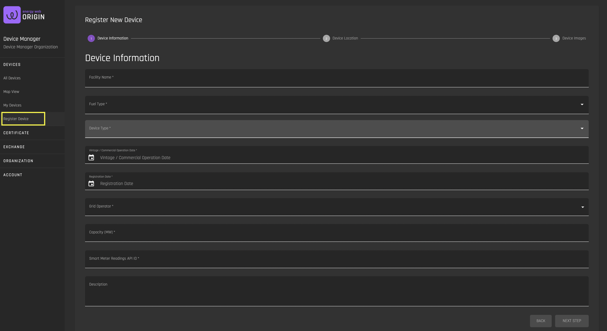
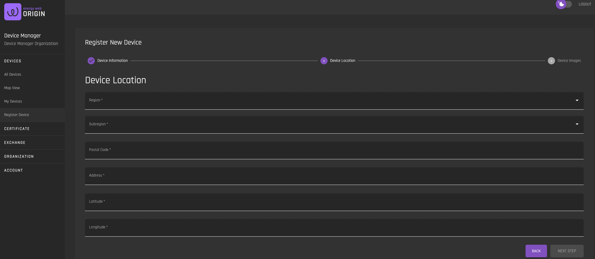

# Register Device 
[**UI Components**](https://github.com/energywebfoundation/origin/tree/master/packages/ui/libs/device/view/src/pages/RegisterPage)

Use this interface to register a new device under your [organization](../user-guide-reg-onboarding.md#organizations). Note that registered device details are public once the device is approved by the Issuer.

## Device Information

### Device Information Fields

|            Field            |                                              Data                                             |
|:---------------------------:|:---------------------------------------------------------------------------------------------:|
| Facility Name               | Input name of generating device                                                               |
| Fuel Type                   | Pre-populated dropdown of generator fuel types (or energy source). Select one.                |
| Device Type                 | Pre-populated dropdown of device types for a given fuel type (or energy source). Data is based on selected Fuel Type. Select one.  |
| Commercial Operation Date   | Select date of device’s first commercial operation                                            |
| Registration Date           | Select date of device registration in I-REC marketplace                   |
| Grid Operator               | Dropdown of grid operators in a given marketplace. Select one.                                |
| Smart Meter Readings API ID |                                                                                               |
| Description                 | Device and its impact description                                                             |

## Device Location

### Device Location Fields

|    Field    |                                 Data                                |
|:-----------:|:-------------------------------------------------------------------:|
| Region      | Pre-populated dropdown of device location’s region. <b>Select one</b>.     |
| Subregion   | Pre-populated dropdown of device location’s sub-region (data is based on selected Region). <b>Select one</b>. |
| Postal Code | Input device location’s postal code.                                |
| Address     | Input device location’s street address.                             |
| Latitude    | Input device location’s longitude string.                           |
| Longitude   | Input device location’s latitude string.                            |

## Device Images

Upload .png or .img files of device. Note that this step is optional. 
