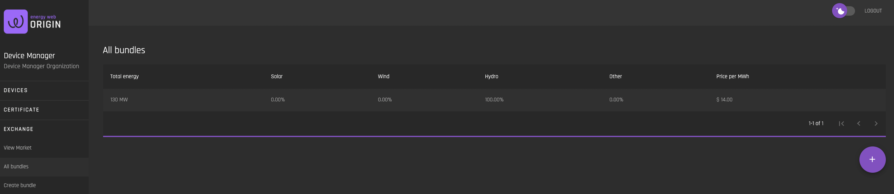

# All Bundles  
[**UI Components**](https://github.com/energywebfoundation/origin/tree/master/packages/ui/libs/exchange/view/src/pages/AllBundlesPage)

The ‘All Bundles’ interface allows users to see all [bundles](../user-guide-glossary.md#certificate-bundle) that are currently posted. **Posted bundles do not appear on the [Market](./view-market.md#market) interface for purchase. The buyer must explicitly select and buy the bundle using the “All Bundles” interface.** The reason for this is mainly the complexity and number of possible EAC combinations. As bundle ratios are defined by the seller through selecting EACs, they can be completely arbitrary (e.g. 23% solar, 36% hydro, 41% wind). With the low number of expected offered bundles, automated matching would not provide a good user experience. A buyer would have to specify the exact ratios for the exchange matching to work. Instead, buyers can manually search through offered bundles and find the ones that fit their requirements.

## Bundle Details/Buy Bundle

To see bundle details and purchase a bundle, select a bundle that is listed. The Bundle Details interface presents possible bundle offers based on the ratios defined by the seller. The buyer can specify a budget using the slidable price range so that possible offerings are filtered and the buyer can choose the package that fulfills the requirements and purchase it directly.  

To buy a package, select the desired package and click “Buy”:

