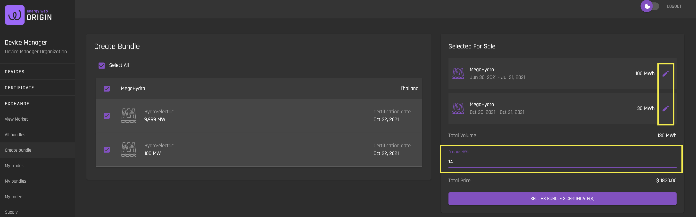

# Create Bundle
[**UI Components**](https://github.com/energywebfoundation/origin/tree/master/packages/ui/libs/exchange/view/src/pages/CreateBundlePage)

The ‘Create Bundle’ interface allows users to group certificates that are active on the exchange together and sell their Mwh as a bundle. 

Note that you can edit the number of Mwh you would like to sell in the bundle using the pencil icon. You must also specify the price per Mwh. After doing so, the total price will be updated according to your changes.  

Once you create your bundle, you can view it in the [My Bundles](./my-bundles.md) interface.

