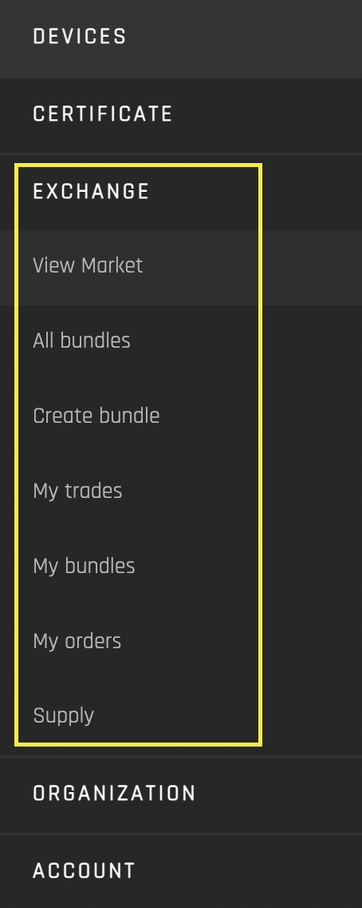

# Exchange
- [**Source code on GitHub**](https://github.com/energywebfoundation/origin/tree/master/packages/trade) 
- [**UI Components**](https://github.com/energywebfoundation/origin/tree/master/packages/ui/libs/exchange) 

The Exchange interface handles the platform’s market activity ([bids](../user-guide-glossary.md#bid), [asks](../user-guide-glossary.mda#ask), trades and sales) for buyers and sellers. It integrates with certificate issuance to allow for trading of [Energy Attribute Certificates (EACs)](../user-guide-glossary.md#energy-attribute-certificate) on the blockchain. 

The interface has seven views:

1. **[View Market](./view-market.md):** Place bid orders and view your bid/sell offers
2. **[All bundles](./all-bundles.md):** View and purchase certificate bundles
3. **[Create bundle](./create-bundle.md)** Create a bundle of your certificates to sell
4. **[My Trades](./my-trades.md):** View your organization’s sales and purchases
5. **[My Bundles](./my-bundles.md):** View and manage your organization's certificate bundles
6. **[My Orders](./my-orders.md):** View your organization’s [bids](../user-guide-glossary.md#bid), [asks](../user-guide-glossary.md#ask) and [demands](../user-guide-glossary.md#demand)
7. **[Supply](./supply.md):** Automate certificate requests for your organization’s devices

