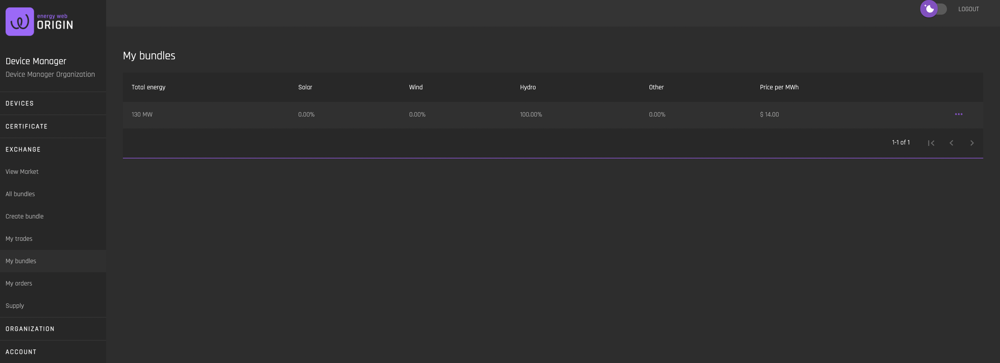
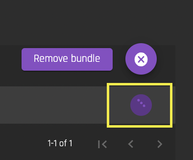
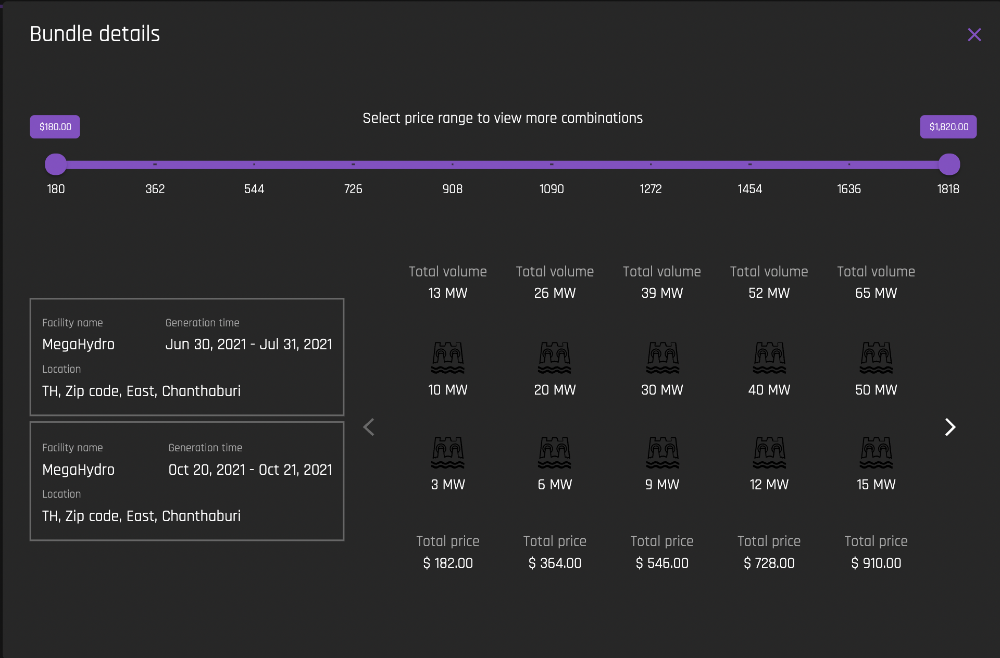
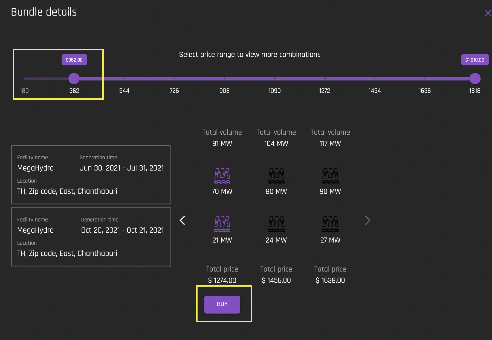

# My Bundles
[**UI Components**](https://github.com/energywebfoundation/origin/tree/master/packages/ui/libs/exchange/view/src/pages/MyBundlesPage)

Use this interface to view your organization’s bundles that were created using the [Create Bundle](./create-bundle.md) interface. 

You can remove a bundle by selecting the ellipses and selecting “Remove Bundle”:

## Bundle Details

Click on any bundle to view the bundle details:

### Buy Bundle

To purchase a bundle, select the bundle by double clicking on it. The Bundle Details interface presents possible bundle offers based on the ratios defined by the seller. The buyer can specify a budget using the slidable price range so that possible offerings are filtered and the buyer can easily choose the package that fulfills the requirements and purchase it directly. To buy a package, select the desired package and click “Buy” (shown below).

