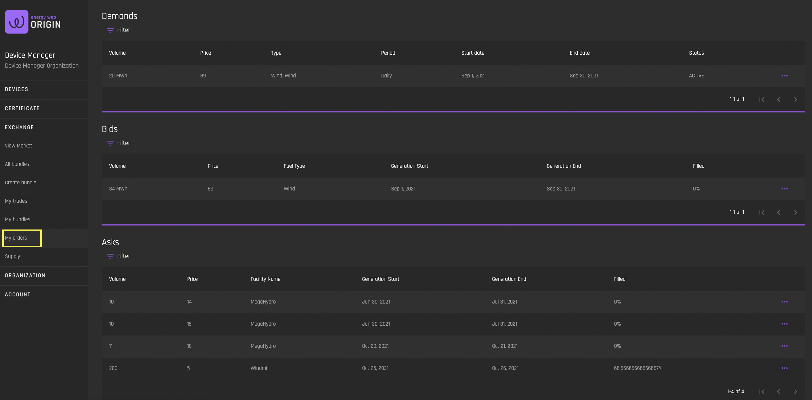
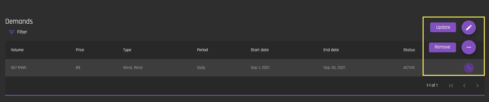
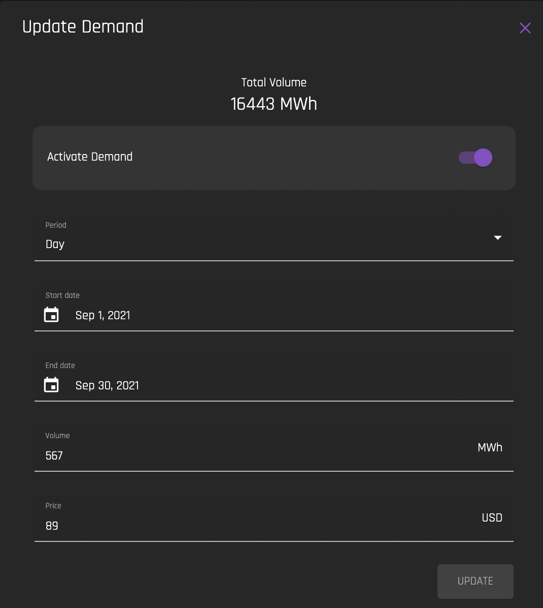
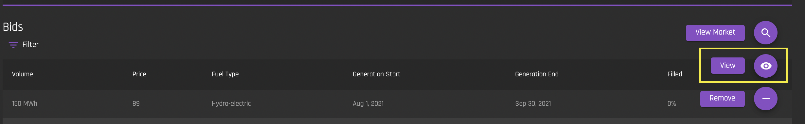
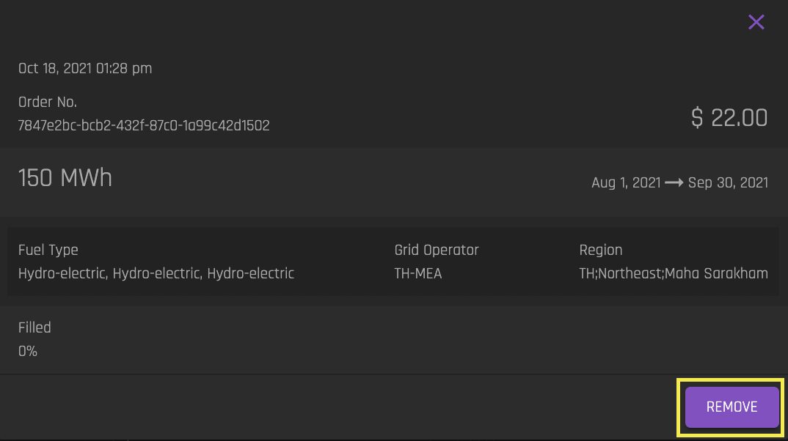
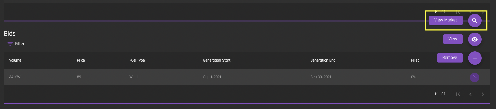
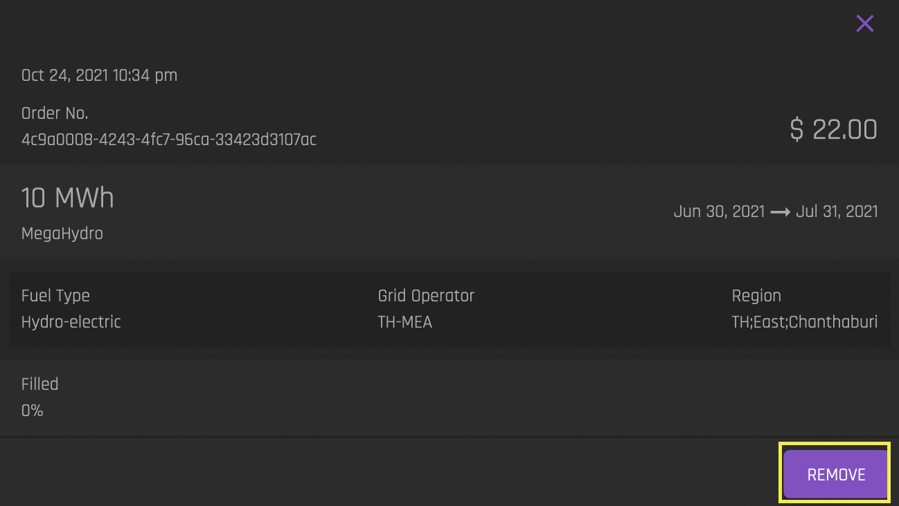

# My Orders
[**UI Components**](https://github.com/energywebfoundation/origin/tree/master/packages/ui/libs/exchange/view/src/pages/MyOrdersPage)

The ‘My Orders’ interface allows a user to see all of the [bids](../user-guide-glossary.md#bid), [asks](../user-guide-glossary.md#ask) and [demands](../user-guide-glossary.md#demand) that users from their organization have created using the [Market interface](./view-market.md#market). 

## Demands
[Demands](../user-guide-glossary.md#demand) are recurring bids. They are created on the [View Market](./view-market.md) interface by creating a ['Repeated Purchase'](./view-market.md#repeated-purchase).

### Update Demand
  

You can update or remove a demand using this interface. Click on the ellipses for the demand you want to update. Click 'Remove' to remove the demand and click “Update” to update the demand. Note that the demand must be 'Active' in order for it to be removed. 

 You can pause this demand by toggling the ‘Activate Demand’ toggle. If you choose to pause the demand, you can reactivate it through this same interface at any time.

## Bid

 You can view your organization's current bids in the 'Bids' list. 

### View Bid

 To view bid details double click on the bid or click on the ellipses next to the bid and select ‘View’:

 

 You will see the bid’s details, as well as the option to remove the bid. If you select ‘Remove’, you will be prompted to confirm that you want to remove the bid. 

 

 If you select 'View Market', you will be navigated to the [Market](./view-market.md#market) form with the filters populated for this bid. 

   

## Asks

You can view your organization's current bids in the 'Asks' list. 

### View Ask
To view ask details double click on the bid or click on the ellipses next to the bid and select ‘View’. 

You will see the ask’s details, as well as the option to remove the ask. If you select ‘Remove’, you will be prompted to confirm that you want to remove the bid:

 If you select 'View Market', you will be navigated to the [Market](./view-market.md#market) form with the filters populated for this ask. 

 

