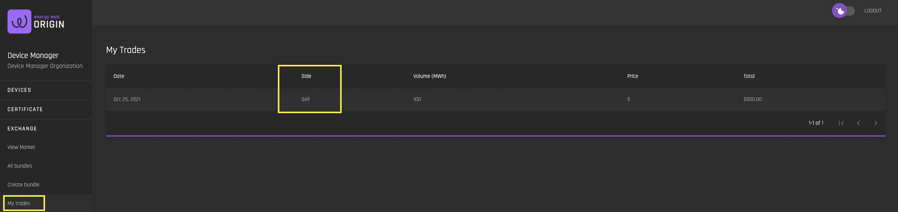

# My Trades
[**UI Components**](https://github.com/energywebfoundation/origin/tree/master/packages/ui/libs/exchange/view/src/pages/MyTradesPage)

The ‘My Trades’ interface allows users to view their executed sales and purchases. The 'Side' column denotes whether it was a purchase ('Buy') or a sell ('Sell). 