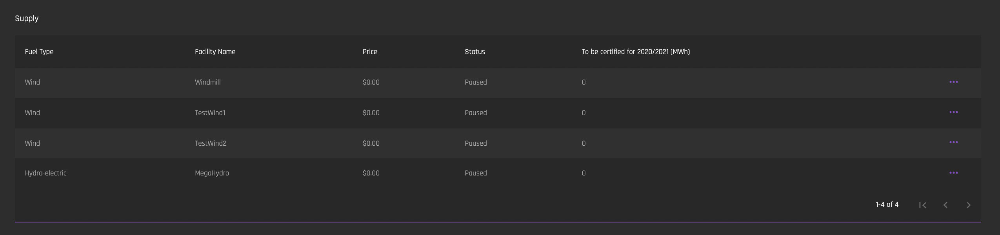
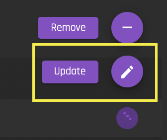
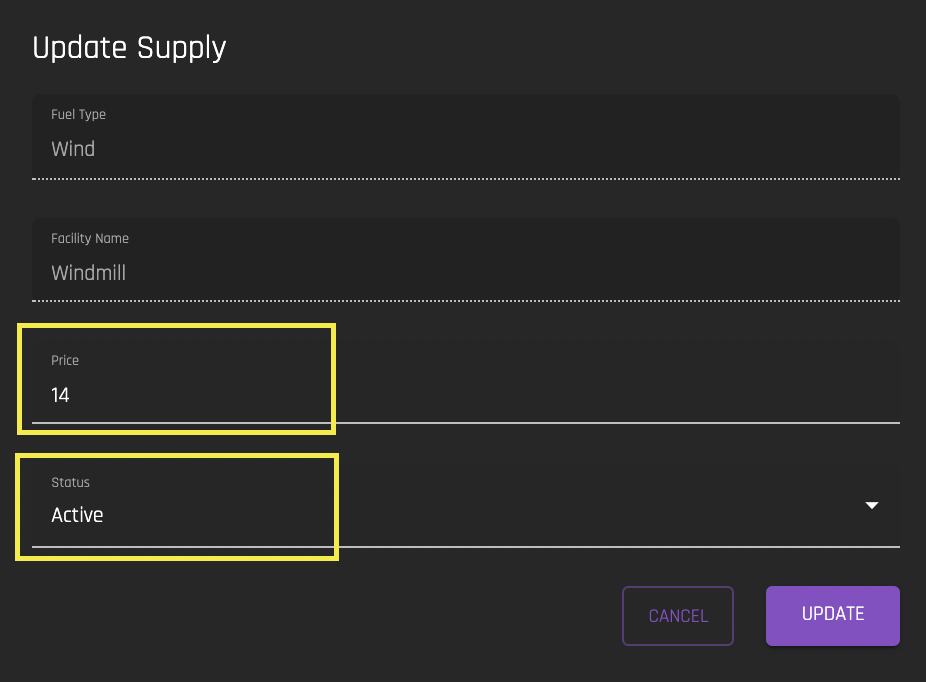

# Supply
[**UI Components**](https://github.com/energywebfoundation/origin/tree/master/packages/ui/libs/exchange/view/src/pages/SupplyPage)

The supply interface allows users to automate the creation of [‘asks’](../user-guide-glossary.md#ask) or sales for certificates of their devices. Whenever a device in your organization is issued a certificate, you can use the Supply interface to create an automatic sale or ‘ask’ offer at a designated price per Mwh. 

The interface shows a list of your organization’s devices. By default, the price will be $0.00 and the status will be ‘Paused’. 

In order to set the price per Mwh, and/or to change status to ‘Active’, click on the ellipses for the device you would like to update and select ‘Update’:

  

Set the desired price per Mwh and set the Status to ‘Active.’ You can update the price or status at any time. 

  

