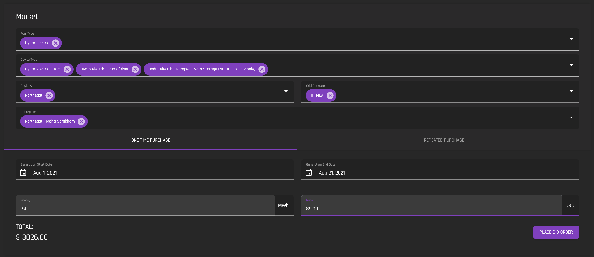
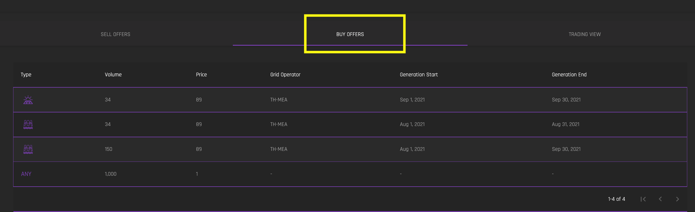
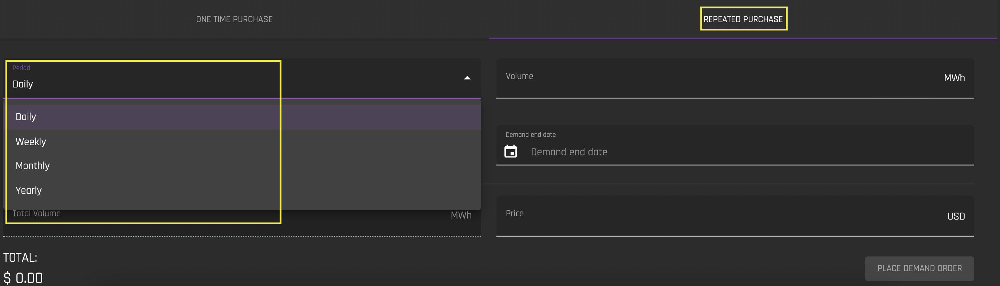
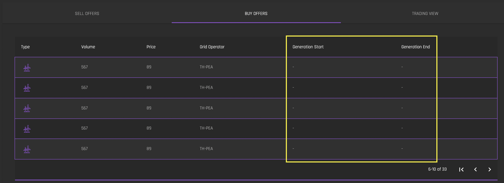
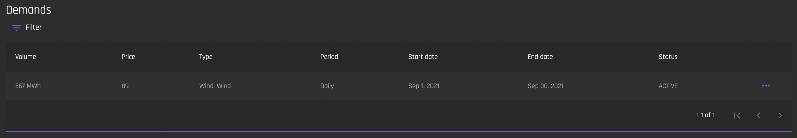
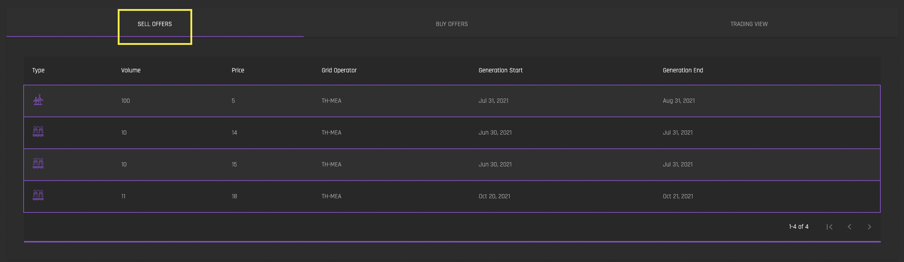
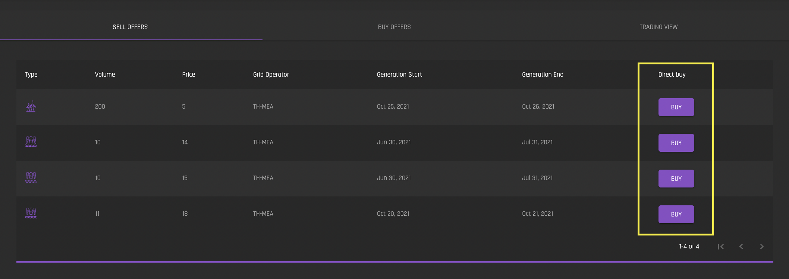
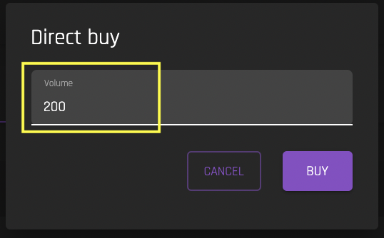
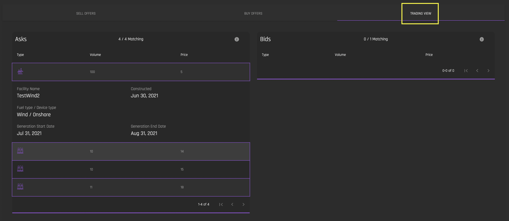

# View Market  
[**UI Components**](https://github.com/energywebfoundation/origin/tree/master/packages/ui/libs/exchange/view/src/pages/ViewMarketPage)

## Market
The Market form is where a buyer makes a purchase request ([bid](../user-guide-glossary.md#bid)) for certificates for a given volume, time period and other specifications. 

To place a one-time ‘buy’ offer (which is the default behavior), fill in the specifications in the Market form. This reference implementation form specifies the type of energy, the location, the generation time period, total Mwh and price that a buyer wants to purchase certificates for. **Note that you must, at a minimum, specify the 'Fuel Type', 'Device Type', 'Generation Start Date', ‘Generation End Date', Energy Mwh amount and 'Price' in order to place a bid.**

Once you click 'Place Bid Order', you will see this ask reflected in the 'Buy Offers' tab below the Market form:

You can also see your Buy Offers in the ‘My Orders’ view in ‘Bids’. 

### Repeated Purchase
To make a buy order for repeated periods (daily, weekly, monthly, yearly) within a given date range, select 'Repeated Purchase', and then specify the frequency for which you would like certification for:  

Once you click 'Place Demand Order', you will see your asks reflected in the 'Buy Offers' tab below the Market form. The number of offers will depend on the period you chose to purchase for in a given generation start and end date. For example, if you chose a frequency of ‘daily’ in a generation time period of one week, you will see 7 entries, each with the volume and price for that purchase period (daily). **Repeated Purchase order will not have a ‘Generation Start’ or ‘Generation End’ specified:**

You can also see your Buy Offers in the [‘My Orders’](./my-orders.md) view under [‘Demands’](./my-orders.md#demands). 

## Sell Offers
The 'Sell Offers' tab lists all of the Mwh that are actively for sale on the exchange. Users can put certificates up for sale in the [Exchange Inbox interface](../certificate-guides/exchange-inbox.md) using the ['Sell' tab](../certificate-guides/exchange-inbox.md#sell). 

*Note that bundles are not included in 'Sell' offers. They must be purchased directly from the seller using the 'All Bundles'(#all-bundles) interface.

### Direct Buy

For all sell offers that are not posted by your organization, there will be a 'Direct Buy' option for each ask:

Click on 'Buy' and edit the number of Mwh you would like to purchase. By default, the total number of Mwh for sale in the ask will be populated for the buy. 

Once the buy goes through, you will see the Mwh in your [Exchange Inbox](../certificate-guides/exchange-inbox.md), and a record of the buy in the [My Trades](./my-trades.md) interface. 

## Trading View

The 'Trading View' tab lists all of the current [Asks](../user-guide-glossary.md#ask) and [Bids](../user-guide-glossary.md#bid) that match criteria that you set in the [Market form](#market) filters. **Note that if you have no filters set in the Market form, all current 'Asks' will be ‘matching’ and no 'Bids' will be matching.** Set filters in the Market tab to narrow down the list of matching 'Asks'. 

