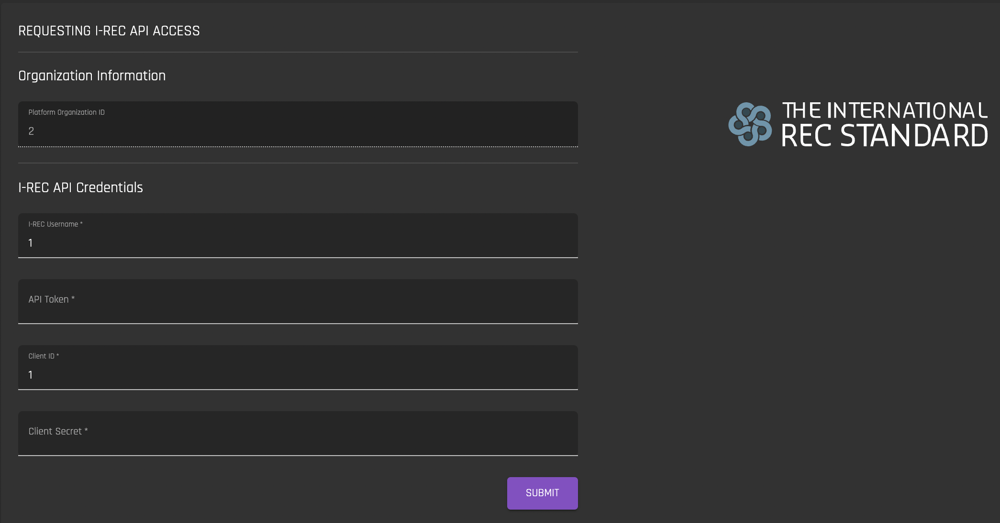

# Connect I-REC
[**UI Components**](https://github.com/energywebfoundation/origin/tree/master/packages/ui/libs/organization/view/src/pages/ConnectIRecPage)

This view allows admins to enter their I-REC credentials to create an API connection with I-REC. The IREC API credentials come directly from I-REC. **Note that this interface is only visible if you have registered with I-REC through the Origin platform.**   

The API connection is needed to perform the following functions on the Origin platform:  

1. [Import Device](../device-guides/import-device.md)
2. [Register Device](../device-guides/register-device.md)
3. [Request Certificate for Device](../device-guides/my-devices.md#requesting-certification-for-device)
4. [Import Certificate](../certificate-guides/import-certificate.md)
5. [Export Certficate](../certificate-guides/exchange-inbox.md#export)

