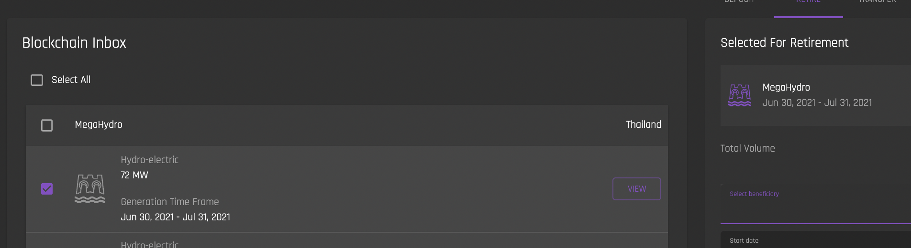

## Create Beneficiary
[**UI Components**](https://github.com/energywebfoundation/origin/tree/master/packages/ui/libs/organization/view/src/pages/CreateBeneficiaryPage)

This view allows admins to create beneficiaries or recipients for retired or claimed certificates. Certificates are retired to the beneficiary's account at the time of retirement. (You can read about the certificate retirement process [here](../certificate-guides/blockchain-inbox.md#retire)).

Three fields are required to create a beneficiary:  
  
1. Full name of the beneficiary
2. Country of the benficiary
3. Location of beneficiary. This is additional location information of the beneficiary (e.g. city, state or region).
