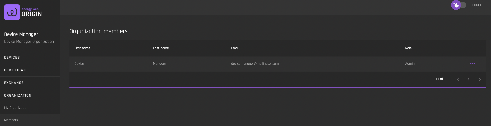
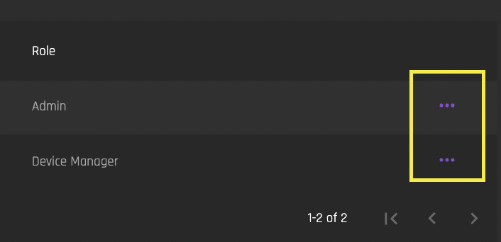
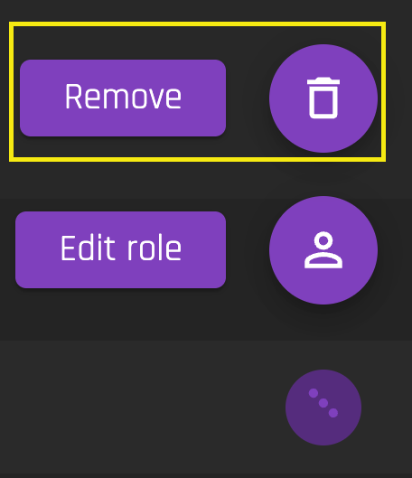
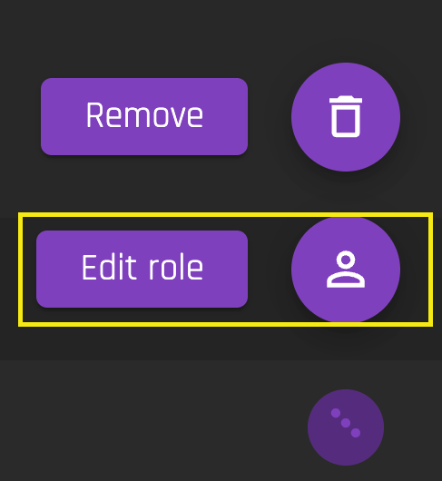

# Members
[**UI Components**](https://github.com/energywebfoundation/origin/tree/master/packages/ui/libs/organization/view/src/pages/MembersPage)

This view provides a list of current [Organization](../user-guide-glossary.md#organization) members and their roles in the system. You can remove a member or edit a member’s role by clicking on the edit indicator:

## Removing a Member  

To remove a member, click “Remove”. They will be notified via email that they have been removed from the organization.  

## Changing a Member's Role

To change a member’s role, click “Edit role” and select their new role from the dropdown menu. They will be notified via email that their role has been changed. 

