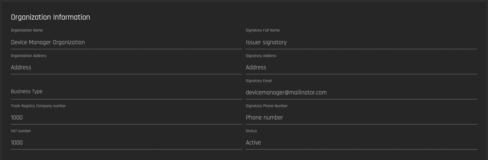
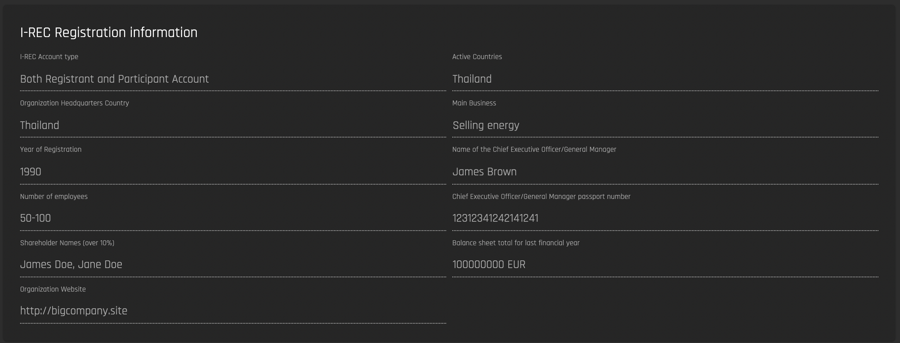
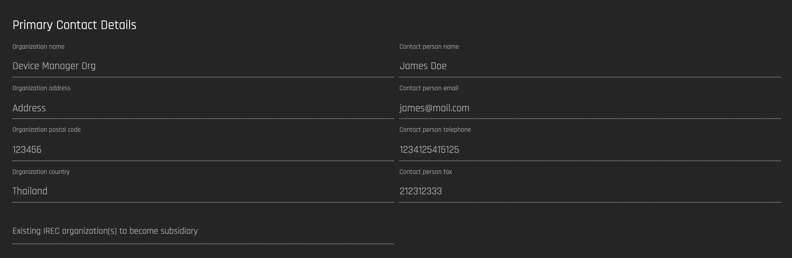
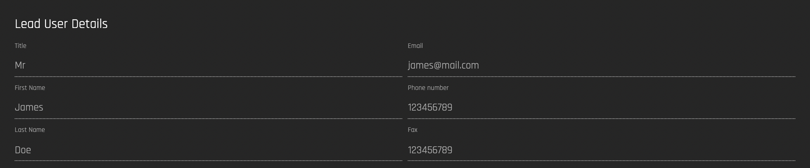

# My Organization

## Organization Information

The information provided when the organization was registered on the Origin platform. You can read more about Organization Registration [here](../user-guide-reg-onboarding.md#registering-organizations)

### I-REC Registration Information

These details are generated when I-REC registration is completed on the Origin Platform. **This table will not be visible if you have not registered your organization with I-REC on the platform.** Read about I-REC registration [here](./connect-irec.md). 

## Primary Contact Details

The contact details of the organization’s primary contact. These details are generated when I-REC registration is completed on the Origin Platform. **This table will not be visible if you have not registered your organization with I-REC on the platform**. Read about I-REC registration [here](./connect-irec.md).  

## Lead User Details

The contact details of the organization’s lead user. These details are generated when I-REC registration is completed on the Origin Platform. **This table will not be visible if you have not registered your organization with I-REC on the platform**. Read about I-REC registration [here](./connect-irec.md).  

