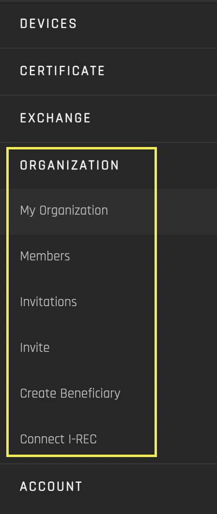

# Organizations  
- [**Source code on GitHub**](https://github.com/energywebfoundation/origin/tree/master/packages/organizations)
- [**UI Components**](https://github.com/energywebfoundation/origin/tree/master/packages/ui/libs/organization) 

The Organization interface allows admin users to manage and invite members to your organization, and to request I-REC API access for your organization. **In the reference implementation, this interface is only visible to users with Admin privileges**. 

An [Organization](../user-guide-reg-onboarding.md#organizations) is the top level of user-hierarchy in the Origin platform. 

The Organization portal has five views: 

1. **[My Organization:](./my-org.md)** View organization information
2. **[Members:](./members.md)** View and manage organization members
3. **[Invitations](./invitations.md):** View a list of pending (sent) and accepted (received) invitations for membership
3. **[Invite](./invite.md):** Invite members to join your organization
4. **[Create Beneficiary:](./create-beneficiary.md)** Designate a beneficiary to receive retired certificates
5. **[Connect I-REC:](./connect-irec.md)** Create an API connection with I-REC using their I-REC API credentials

