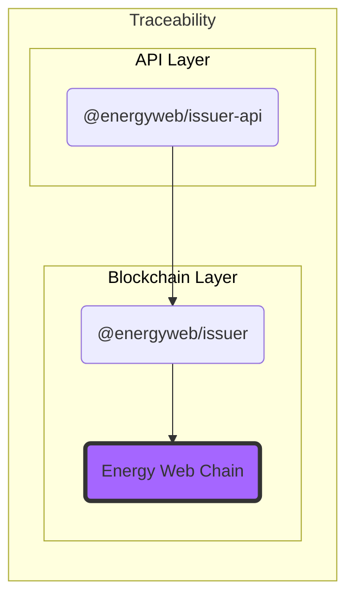
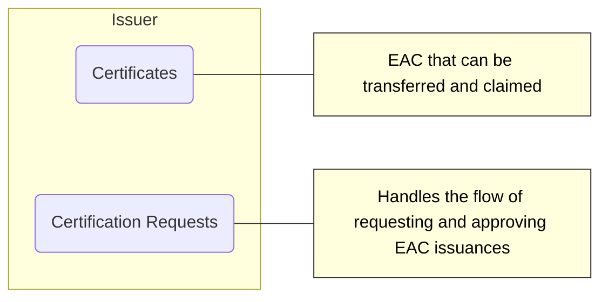

# Traceability SDK

Traceability SDK is responsible for tracking (tracing) the exchange of Energy Attribute Certificates (EACs).

The main functions that the Traceability SDK deals with are:

1. Issuance
2. Transfer
3. Claiming / Redemption

## Components overview

### Layers

### @energyweb/issuer

Package contains all the facades and entities that concern the on-chain presence of Certificates and Certification Requesting.

