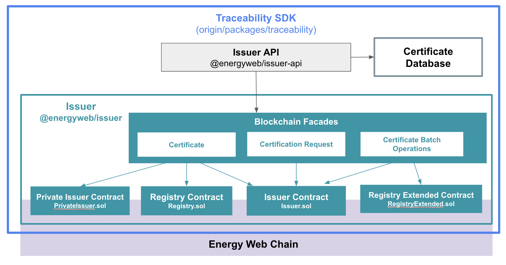

# Traceability SDK
[**Source code on GitHub**](https://github.com/energywebfoundation/origin/tree/master/packages/traceability)

## Overview
The Traceability SDK is responsible for the **request**, **issuance** and **exchange** of [Energy Attribute Certificates](./user-guide-glossary.md#energy-attribute-certificate) on the Origin platform. Certificates are requested by device owners, and approved by issuers. The issuer is the entity that is responsible for reviewing the energy generation evidence and issuing the certificate in a way that conforms with legislative and industry standards.  

## Traceability SDK Packages  
The Traceability SDK has two core packages:  
### 1. **[Issuer - @energyweb/issuer](./traceability/packages/issuer.md)**  
The issuer package handles the management of certificates on the blockchain. It has two primary components:   

+ Smart contracts that maintain the on-chain lifecycle of certificates      
+ Facades for interacting with smart contract methods. The Issuer API uses these facades rather than interacting with the blockchain directly. 

### 2. **[Issuer API- @energyweb/issuer-api](./traceability/packages/issuer-api.md)** 
Services and event handlers for managing certificate operations and persisting certificate data off-chain. Issuer API services use the [Issuer blockchain facade](./traceability/contracts/Issuer.md#blockchain-facade) and on-chain event listeners to create and respond to events on the blockchain.  

Figure 1: Core packages of Traceability SDK (Issuer API, Issuer)  

## Energy Attribute Certificates on the Blockchain  
[Energy Attribute Certificates](./user-guide-glossary.md#energy-attribute-certificate) are issued by formal bodies to [electricity generating devices](./device-guides/device-guide-intro.md) to certify that they produced a reported amount of green energy in an established time frame. There are various formal issuing bodies for different regions.  

Certificates must account for the generation device information, the total energy volume produced, and the time frame the energy was produced in. The volume of energy produced can then be broken down into smaller units and sold to different buyers as Energy Attribute Certificates. *Note that Origin’s reference implementation interface uses Mwh as the standard unit of energy volume, however any unit can be used according to implementation needs.*  

Certificates that are issued through the Origin platform are minted as tokens on the [Energy Web blockchain](https://energy-web-foundation.gitbook.io/energy-web/technology/the-stack/trust-layer-energy-web-chain). A token is a digital asset that has a specific owner, who can perform certain actions such as transferring the token to another owner. Tokens are, at their core, [smart contracts](https://ethereum.org/en/developers/docs/smart-contracts/). The smart contract defines the token’s behavior through an interface, which is referred to as a [token standard](https://ethereum.org/en/developers/docs/standards/tokens/#token-standards). This ensures that tokens behave in a predictable and defined manner.   

Origin Certificates are minted on the blockchain as [ERC-1188 Transferable Certificates](https://github.com/ethereum/EIPs/issues/1888). The ERC-1188 standard extends the [ERC-1155 Multi-Token Standard](https://eips.ethereum.org/EIPS/eip-1155), meaning it inherits all of the functionality of ERC-1155 and adds additional behavior. It is the combination of these standards that allow the device details, generation timeframe and certificate issuer to be unique and immutable, while allowing the certificate's volume of energy produced to be divided into smaller units and transferred or sold to other addresses on the Origin marketplace. These units are always tied back to the non-fungible, immutable component of the certificate - the device information, the generation time period and the issuer address.  

Below we briefly explain the benefits of the ERC-1188 and the ERC-1155 standard in the context of representing on-chain Energy Attribute Certificates. You can read more detail about the Certificate structure as a token [here](https://energyweb.atlassian.net/wiki/spaces/OD/pages/883916918/Certificate+structure). 

### ERC-1155: Fungible and Non-Fungible Components  
The ERC-1155 Multi-Token standard has a fungible and a non-fungible component. The device information, total energy volume produced, the generation time period and the certificate issuer reside in the non-fungible component of the token.  

The energy volume generated by the device makes up the fungible component of the certificate. The volume can be divided into smaller units and purchased by multiple buyers. Each unit is always linked back to the non-fungible component that holds the immutable data about the device, the generation time period and the issuer. 

[ERC-1155's burn method](https://docs.openzeppelin.com/contracts/3.x/api/token/erc1155#ERC1155-_burn-address-uint256-uint256-) is used to decommission certificates when they are [claimed](#claim-certificate). 

Read more about the Certificate’s data structure [here](https://energyweb.atlassian.net/wiki/spaces/OD/pages/883916918/Certificate+structure). 

### ERC-1888: Establishing Certificate Structure and Behavior  
The ERC-1188 is a Transferable Certificate or “Claim”. This standard introduces an “issuer” to the Certificate, which, in the context of Origin, represents a certificate issuing body (e.g. I-REC).  

The issuer is responsible for:    
1. Approving/issuing certificates  
2. Revoking certificate requests  
3. Minting certificates (adding additional volumes of energy to an existing certificate)  
4. Asserting the validity of certificates  
5. When finding a certificate invalid, revoking that certificate. This behavior is necessary in the context of Origin, because the issuing body must have authority to oversee and maintain integrity of the system, as they have in traditional issuing mechanisms. 

This standard also establishes the structure of the on-chain certificate. Read more about the Certificate data structure [here](https://energyweb.atlassian.net/wiki/spaces/OD/pages/883916918/Certificate+structure). 

## Certificate Lifecycle:  

### 1. **Certificate request** 
Users (device owners) can request the issuance of certificates for a specific generation device and a specific time frame. They must provide the issuer with generation evidence from the device at the defined time. Based on this evidence, the energy volume can be determined and thereby the number of certificates (e.g. each 1 MWh) that is requested.  

A specific address can be defined to issue the certificates to. The default is the address that called the function. Users can request public and private certificates. 

### 2. **Certificate approval** 
Issuers receive the issuance request, defining the the device and time frame, together with the generation evidence. Based on this information, the issuer can define the number of certificates to be issued and initiate the issuance.  

After the issuance request is approved, [a multi-token](#energy-attribute-certificates-on-the-blockchain) is minted on-chain that contains the data given in the request. In the case of a public certificate, the energy volume generated is disclosed. In the case of a private certificate, the energy volume remains undisclosed on the blockchain and is stored off-chain. 

### 3. **Direct certificate issuance** 
Issuers under some circumstances issue certificates without a request being made. Examples could be the direct import of certificates from other registry systems or the need for corrections in the unlikely event of a mistake made by the user or issuer.  

### 4. **Certificate transfer** 
Public certificates can be transferred between users on the platform or external accounts without any additional information, however private certificates must first be made public to transfer, or the transaction must be approved by the issuer. **Note that transferring certificates is not the same as trading certificates on the exchange.** 

### 5. **Certificate validation** 
The issuing body can confirm certificate validity.

### 6. **Certificate revocation**
The issuer can, under some circumstances, revoke certificates. Reasons could be that it is uncovered that there was a problem with the provided generation evidence, or the user did not pay the registry fee. As a result, the issuer has the power to revoke certificates and certificate requests. Once a certificate is revoked, it can no longer be claimed or transferred because its validityData() callback function will return that it is invalid.  

Revoking a certificate will automatically revoke the issuance request and invalidate its validity data. Revoking works for both public and private certificates. 

### 7. **Claim Certificate**
Certificate owners can claim their certificates for reporting purposes. The 'claimed' state is the final stage of the certificate lifecycle. 

Claimed certificates are locked and cannot be moved on to the Exchange, withdrawn to another wallet address, or transferred to another user. Claiming prevents any other entity from performing any action with the certificate. The issuer cannot suspend or revoke a claimed certificate. Certificates that have been kept private by the owner, concealing volume information, are made public before they are claimed as only public certificates can be claimed to ensure transparency and prevent double counting. 

See documentation on the claim process [here](./traceability/packages/issuer.md#claiming-certificates).

### Additional Reading
For more context and detail on the Traceability SDK:  

- ["Issuing certificates with the EW Origin SDK (Part I)" on Medium](https://medium.com/energy-web-insights/issuing-certificates-with-the-ew-origin-sdk-part-i-7630c14e13b)
- ["Issuing certificates with the EW Origin SDK (Part II)" on Medium](https://medium.com/energy-web-insights/issuing-certificates-with-the-ew-origin-sdk-part-ii-e18fa907c57)  

