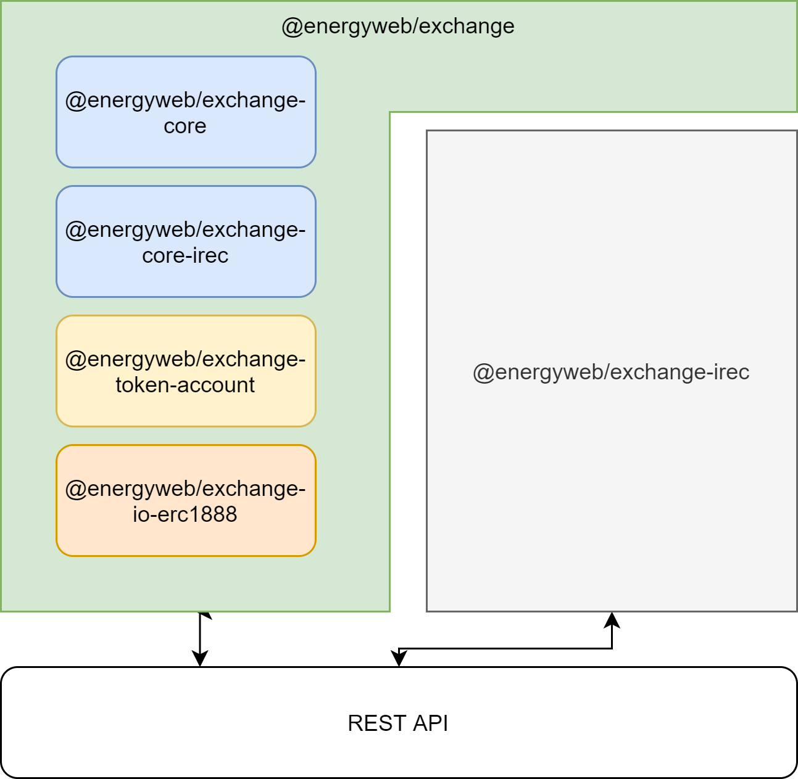

# Trade SDK

Trade SDK is responsible for enabling an order book style exchange for RECs. It was designed to support different types of RECs and matching scenarios.

<div class="admonition note">
  <p class="first admonition-title">Note</p>
  <p class="last">
    For in-depth information on how order book style exchange works in the context of RECs trading please refer to <a href="https://energyweb.atlassian.net/wiki/spaces/OD/pages/1138884622/Exchange+Module">https://energyweb.atlassian.net/wiki/spaces/OD/pages/1138884622/Exchange+Module</a>
  </p>
</div>

## Components overview



### @energyweb/exchange-core

Package contains the implementation of order book based matching engine with robust test engine that allows developers to instantiate their own version based on the supplied types for **TProduct** and **TProductFilter**.

```typescript
export class MatchingEngine<TProduct, TProductFilter> {
  ...
}
```

[Source](https://github.com/energywebfoundation/origin/blob/63fae4a9035e3b5dc864b20a7671efae0d941d00/packages/trade/exchange-core/src/MatchingEngine.ts#L39)

Origin matching engine uses a custom algorithm for matching bids and asks, the matchable properties are:

-   price
-   product

while ordering is based on order arrival time.

Both `price` and `product` matching can be customized to meet the needs of the implementers.

Concrete use-case implementations are available in a separate packages

-   I-REC Product Matching rules - `@energyweb/exchange-core-irec`

#### Price strategies

Price strategies allows developers to provide custom price matching rules. Strategies are required to conform to:

```TypesScript
export interface IPriceStrategy {
    pickPrice(ask: IOrder, bid: IOrder): number;
}
```

[Source](https://github.com/energywebfoundation/origin/blob/121fafd84515d482b42b477fe9f8c617481d22b2/packages/trade/exchange-core/src/strategy/IPriceStrategy.ts)

`@energyweb/exchange-core` by default ships with two different strategies:

1. AskPriceStrategy

```typescript
import { IOrder } from '../IOrder';
import { IPriceStrategy } from './IPriceStrategy';

export class AskPriceStrategy implements IPriceStrategy {
    pickPrice(ask: IOrder, bid: IOrder): number {
        return ask.price;
    }
}
```

[Source](https://github.com/energywebfoundation/origin/blob/121fafd84515d482b42b477fe9f8c617481d22b2/packages/trade/exchange-core/src/strategy/AskPriceStrategy.ts)

<div class="admonition attention">
  <p class="first admonition-title">Attention</p>
  <p class="last">
    Price picking strategy is always executed after successful matching for price, time and product
  </p>
</div>
****

Example above implements the strategy such as after successful matching the price that is going to be used to close the trade would be always `ask` price.

#### Custom product matching

The `MatchingEngine` is designed in such way that it delegates the product matching to `Order` object that has to conform `IMatchableOrder<TProduct, TProductFilter>` interface. By enabling that the `MatchingEngine` can operate on the orders which contains **any** product.

<div class="admonition note">
  <p class="first admonition-title">Note</p>
  <p class="last">
    By <b>product</b> we mean a set of attributes assigned to a RECs like for e.g fuel type, location, grid operator etc
  </p>
</div>

The example of _product_ that is being used for I-REC based RECs is

```typescript
export class IRECProduct {
    public deviceType?: string[];
    public location?: string[];
    public deviceVintage?: DeviceVintage;
    public generationTime?: TimeRange;
    public gridOperator?: string[];
}
```

[Source](https://github.com/energywebfoundation/origin/blob/master/packages/trade/exchange-core-irec/src/IRECProduct.ts)

Now, in order to provide the MatchingEngine a compatible type for `Orders` one need to provide object that follows an `IMatchable<IRECProduct, IRECProductFilter>` specification

```typescript
export interface IMatchableOrder<TProduct, TProductFilter> extends IOrder {
    filterBy(productFilter: TProductFilter): boolean;
    matches(order: IMatchableOrder<TProduct, TProductFilter>): boolean;
    clone(): IMatchableOrder<TProduct, TProductFilter>;
    updateWithTradedVolume(tradedVolume: BN): IMatchableOrder<TProduct, TProductFilter>;
    product: TProduct;
}
```

[Source](https://github.com/energywebfoundation/origin/blob/121fafd84515d482b42b477fe9f8c617481d22b2/packages/trade/exchange-core/src/IMatchableOrder.ts)

```typescript
export class AskProduct implements IMatchableProduct<IRECProduct, IRECProductFilter> {
    public filter(productFilter: IRECProductFilter): boolean {
        const hasMatchingDeviceType = this.filterByDeviceType(productFilter);
        const hasMatchingVintage = this.filterByDeviceVintage(productFilter);
        const hasMatchingLocation = this.filterByLocation(productFilter);
        const hasMatchingGenerationTime = this.filterByGenerationTime(productFilter);
        const hasMatchingGridOperator = this.filterByGridOperator(productFilter);

        return (
            hasMatchingDeviceType &&
            hasMatchingVintage &&
            hasMatchingLocation &&
            hasMatchingGenerationTime &&
            hasMatchingGridOperator
        );
    }

    public matches(product: IRECProduct): boolean {
        const hasMatchingDeviceType = this.hasMatchingDeviceType(product);
        const hasMatchingVintage = this.hasMatchingVintage(product);
        const hasMatchingLocation = this.hasMatchingLocation(product);
        const hasMatchingGenerationTime = this.hasMatchingGenerationTime(product);
        const hasMatchingGridOperator = this.hasMatchingGridOperator(product);

        return (
            hasMatchingDeviceType &&
            hasMatchingVintage &&
            hasMatchingLocation &&
            hasMatchingGenerationTime &&
            hasMatchingGridOperator
        );
    }

    ...
}
```

[Source](https://github.com/energywebfoundation/origin/blob/master/packages/trade/exchange-core-irec/src/AskProduct.ts)

For some use-case it might be necessary to provide a separate object for Asks and Bids.

### @energyweb/exchange

The main responsibilities for `@energyweb/exchange` project is to:

-   provide an API endpoints to interact with Trading features
-   host matching engine
-   persistency concerns for Orders, Trades
-   accounting and reports
-   deposits and withdrawals
-   higher level features like Demand, Supply

<div class="admonition note">
  <p class="first admonition-title">Note</p>
  <p class="last">
    Since matching engine is an <i>generic</i> class, it requires certain parts of <b>@energyweb/exchange</b> to be implemented for concrete <b>TProduct</b> and <b>TProductFilter</b>
  </p>
</div>

#### @energyweb/exchange-irec

This package contains the implementation for all endpoints to conform with **TProduct** and **TProductFilter** implemented in `@energyweb/exchange-core-irec`

### @energyweb/exchange-io-erc1888

Exchange project by design allows different type of assets to be used for trading, `@energyweb/exchange-io-erc1888` provides the implementation for ERC1888 certificates deposits and withdrawals.

### @energyweb/exchange-token-account

Smart contract wallet for deposits with ERC1888 tokens support.
