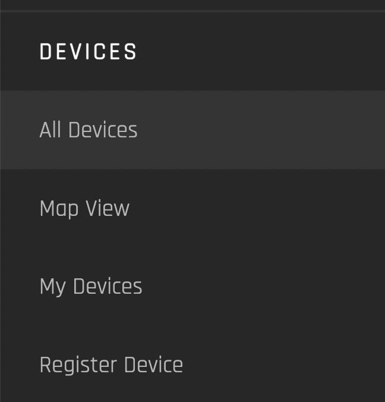

# User Guide - Device Management

If you are a device manager, you can register and manage devices through the Origin marketplace.

## Devices

‘Devices’ are electricity generating assets (e.g solar pv, hydroelectric dam, steam turbine.) They must be registered in the system to provide their capacity, location and generation data. This data is used to provide trust in the validity of the certificates that are issued for their generation. A user that is associated with a registered organization can register a device within the system. 

### Accessing Device Generation Data

Origin offers the possibility to connect an external metering system. In order for this to work, a custom integration to the specific metering system is required. Devices have to be approved by the issuer in order to be used on the platform.

The local issuer receives the device registration and can verify the data and approve the device. Everything that involves additional processes of the registry, (e.g. if there is a need for an on-site visit or additional documents), is handled directly between the user and the registry.

Once you have an active account in the Origin platform and are part of an organization, you can register your devices on the platform.

The Device interface has four views. The purpose and utility of each view is explained in detail below.

1. <b>[All Devices:](##all-devices)</b> Allows any user to see all registered devices within a marketplace. Selecting a single device allows you to see the detail view of each device. You do not need to be logged in to view this interface.
2. <b>[Map View:](##map-view)</b> Allows any user to see registered devices within a marketplace as locations on a map. Selecting a single device allows you to see the detail view of each device. You do not need to be logged in to view this interface.
3. <b>[My Devices:](##my-devices)</b> Allows any logged in user to see their organization’s registered devices and each device’s status.
4. <b>[Register Device:](##register-device)</b> Allows any logged in user that is registerd with an organization to register a device on behalf of that organization.

## All Devices

https://origin-ui-canary.herokuapp.com/device/all

This view provides a tile view of all devices registered within a marketplace:

To view a device’s details, click the device image or image placeholder. If hovered over, you will see “View Details”:

### Device Detail View

https://origin-ui-canary.herokuapp.com/device/detail-view/e3ac3a98-0739-4d14-afef-c51b0a03d282

This view provides high-level generation capacity, certification overview and smart meter readings for a single device. 

#### Device Details

##### Device Overview 

|           <b>Field</b>           |                                                               <b>Data</b>                                                               |
|:-------------------------:|:-------------------------------------------------------------------------------------------------------------------------------:|
| Certified MW              | MWh of generation already certified                                                                                             |
| Nameplate Capacity        | Maximum generation capacity in MW                                                                                               |
| Certified by Registry     | The registration body that issues the device’s Energy Attribute Certificate(s) (i.e. IREC)                                      |
| To Be Certified           | Generation in MWh Pending certification                                                                                         |
| Other green attributes    | For example, labels associated with the device like EKOenergy                                                                   |
| Public Support            | Any financial subsidies (e.g., feed-in-tariff) received by the generating asset from the government or other public institution |
| Commercial Operation Date | Date of first commercial operation                                                                                              |

<b>Device Owner and Location Details</b>

|      <b>Field</b>      |                     <b>Data</b>                    |
|:---------------:|:-------------------------------------------:|
| Device Owner    | Organization ID of device owner             |
| Device Location | Country flag indicator, region, city, state |
|      | Geographic coordinates of device            |
|         | Longitude, latitude of device               |

##### Smart Meter Readings

Use this interface to select a timeframe to view the device’s meter reading values in MWh. 

## Map View

https://origin-ui-canary.herokuapp.com/device/map 

Use this interface to see devices registered within a marketplace across geographic locations. Click any pin and select “See More” to view the device details.

## My Devices

Use this interface to view all of your organization's registered devices. 

|  | Click on <b>“View Details”</b> to view device details. |
|-------|--------------------------------------------------------|

Click anywhere else on the device card to request certificates for the device.

## Request Certification for Device
Once your device is active on the platform (i.e., the device has been registered with the I-REC Standard and the platform), you can certify produced electricity for a given period of time with the I-REC Standard and request issuance of corresponding I-RECs.

<b>Monthly certification</b> is the most common practice in the market, however most standards allow for a daily granularity.

Requesting certificates for a specific generation device happens manually as most standards do not allow for SCADA data to be used as generation evidence. The user is required to upload the official settlement document provided by the grid operator as generation evidence. The evidence has to be provided for the right generation device and time frame to be approved.

The local issuer receives the certification request, can verify the evidence and approve the request. The request is recorded as a blockchain transaction on-chain.

### Certificate Request Fields

|                   <b>Field</b>                |                               <b>Data<b>                                               |
|:----------------------------------------:|:------------------------------------------------------------------------------------------------:|
| From                                     | Select initial date for generation period                                                        |
| To                                       | Select last date for generation period                                                           |
| Amount of energy in MWh                  | Input MWh generated in time selected period                                                      |
| Drop files here or click to select files | Upload generation evidence (e.g., official settlement document(s) provided by the grid operator. |

Once your request is processed, you will be able to see it under <b>Certificates -> Pending</b>. 

The issuing body will be automatically notified about your request and will review it within 5 working days. You will receive an email notification about any updates to your request. 

## Register Device

Use this interface to register a new device under your organization(link). Note that registered device details are public.

### Device Information

#### Device Information Fields

|            Field            |                                              Data                                             |
|:---------------------------:|:---------------------------------------------------------------------------------------------:|
| Facility Name               | Input name of generating device                                                               |
| Fuel Type                   | Pre-populated dropdown of generator fuel types (or energy source). Select one.                |
| Device Type                 | Pre-populated dropdown of device types for a given fuel type (or energy source). Select one.  |
| Commercial Operation Date   | Select date of device’s first commercial operation                                            |
| Registration Date           | Select date of device registration in I-REC marketplace Jonathan Waldenfels                   |
| Grid Operator               | Dropdown of grid operators in a given marketplace. Select one.                                |
| Smart Meter Readings API ID |                                                                                               |
| Description                 | Device and its impact description                                                             |

### Device Location

#### Device Location Fields

|    Field    |                                 Data                                |
|:-----------:|:-------------------------------------------------------------------:|
| Region      | Pre-populated dropdown of device location’s region. <b>Select one</b>.     |
| Subregion   | Pre-populated dropdown of device location’s sub-region. <b>Select one</b>. |
| Postal Code | Input device location’s postal code.                                |
| Address     | Input device location’s street address.                             |
| Latitude    | Input device location’s longitude string.                           |
| Longitude   | Input device location’s latitude string.                            |

### Device Images

Upload .png or .img files of device.

