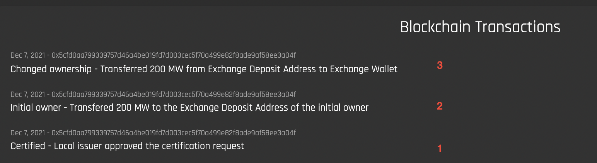

# Glossary of Terms

## Ask
With **asks**, sellers offer to sell a specific set of [Energy Attribute Certificates (EACs)](#energy-attribute-certificate) with a specific volume for a specific price. Users can define the volume and price when creating the ask. Asks are tied directly to the EACs that the seller owns and that are in the seller’s Exchange Inbox. Every EAC in the system is represented by the “asset” data structure that holds the EAC information, such as device ID and generation time. An ask is tied to one specific asset which means that it can only contain certificates from one device and a specific generation time frame. Users can only create asks for asset volumes that are currently in the active part of their Exchange Inbox. The one-to-one connection between ask and asset ensures that sellers can only offer EACs that they actually own and have locked on the Exchange.  

By creating an ask, the specified EACs are offered for sale and the order becomes visible on the Exchange(./exchange-guides/view-market.md). The corresponding asset volumes are moved to the locked part of the Exchange Inbox. Locking the asset volume ensures that the EACs cannot be withdrawn from the exchange or offered for sale in a second ask. As a result, all buyers on the Exchange can be sure on a technical level that asks are backed by the correct amount of EACs. 

The ask that appears on the Exchange only includes price, volume, and underlying EAC information. It does not disclose any information about the user that created the bid. All orders that are created on the Exchange are anonymous. This is possible because the Exchange operator keeps all the ownership information in the back-end and order matching is done through the operator’s system. 

Asks that are not bought or matched can be canceled. Canceling an ask moves the offered asset value back to the active part of the Exchange Inbox. The underlying EACs can now be withdrawn again or be used to create another bid. Canceled asks can also be reactivated but only if the matching asset volume is available in the user’s Exchange Inbox. **Once made, asks cannot be updated**. To change parts of the ask, such as the price, the ask has to be canceled and a new ask has to be created.  

### Requirements
- Every ask must be connected to exactly one renewable energy device
- The ask volume cannot be larger than the asset volume in the active part of the Exchange Inbox
- Once created, the ask has to appear on the Exchange without disclosing any user information
- The asset volume corresponding to the ask has to be moved to the locked part of the Exchange Inbox
- Only asks that have not been matched or bought can be canceled
- An ask can only be reactivated if the user has a matching amount of asset volume in the active part of the user Exchange Inbox

## Asset
Assets represent [Energy Attribute Certificates](#energy-attribute-certificate) that are active on the exchange. Every asset is tied to one specific device and a specific generation time frame. The Asset contains the most important EAC information, such as:  

  - The address of the EAC token smart contract
  - The id of the non-fungible part of the EAC token
  - The id of the generation device and the time frame of the generation.  

Storing EAC token data this way allows efficient information handling and trading on the Exchange. 

## Bid  
**Bids** are the buy offers that are posted by buyers to express their desire to buy [Energy Attribute Certificates (EACs)](#energy-attribute-certificate) on the Exchange. Unlike [asks](#ask), bids are not tied to specific EACs. Bids are entirely defined by the buyer’s needs, which vary in terms of their respective proof of impact needs. Bids include a maximum price, a volume, and a requirement specification that we call “product”. The maximum price is the highest price that a buyer is willing to pay per EAC. The volume defines the amount of EACs (i.e., the volume of MWh) that a buyer wants to buy.     

The buyer can define the characteristics that the underlying EAC of an ask has to fulfill in order to be matched. In our reference implementation, the product allows the buyer to define the device type, such as solar or wind, device vintage (i.e., the installation date), the location or grid region, and the MWh generation time frame. But it would be possible to expand this to many other characteristics to meet buyers’ needs. **All of these product specifications are entirely optional**, and so the buyer can simply choose to specify “any” to express that a given characteristic is not important to increase the number of possible product matches.   

As the bid is not tied to  an EAC, any registered user can always create a bid without any requirements from the system. But users should be aware that **creating a bid means signaling a commercially binding intent to actually buy EACs if they are matched with an ask.** To only be __notified__ when a matching ask is found, users can choose to create a notification instead of a bid. The notification includes all the same criteria as the bid with one exception: The user does not have to define an EAC volume. This allows the user to create notifications solely based on the product specification and price without having to commit to a specific volume. The idea behind this is that buyers can already monitor the market without having to know exact electricity consumption data—increasing market transparency.   

Like asks, bids appear anonymously on the Exchange once created. Only the Exchange operator knows which bid was created by which user. If the bid is matched, it is instantly removed from the Exchange. If not, it is visible on the Exchange with the expectation that a matching ask will be created in the future. Buyers can choose to cancel bids that have not been matched to remove them from the Exchange. Users can also choose to cancel notifications. Bids cannot be updated. To change parts of the bid like the price, the ask has to be canceled and a new bid has to be created.    

### Requirements    
- Only registered users can create a bid
- Buyers have to specify maximum price and volume to create a bid
- Buyers should be able to define device type, device vintage, location or grid region, and time frame, if not selected the system default should be “any”
- Buyers have to specify a maximum price to create a notification
- When created, the bid with the right specifications should appear on the Exchange
- Only bids that have not been matched can be removed
- When removed, the bid should disappear from the Exchange

## Certificate Bundle  
Bundles are products that are compiled from a number of different EACs that are offered to buyers as one entity. 
 
One of the main characteristics of [Energy Attribute Certificates (EACs)](#energy-attribute-certificate) is that one certificate originates from exactly one specific device and one time-frame (see [Certificate structure](https://energyweb.atlassian.net/wiki/spaces/OD/pages/883916918/Certificate+structure)). In order to offer certificates from multiple devices and/or multiple time-frames while still adhering to this principle, sellers have to create certificate bundles. The Origin SDK includes the bundles-feature that lets sellers choose a number of different EACs and offer them as a bundled product. 

The main difference between buying regular EACs and buying EACs in bundles is that bundles define available EAC packages. The buyer can only buy EACs in the defined ratios of the bundle. If the bundle defines 20% Solar Farm, 30% Hydro Plant and 50% Wind Farm, the buyer can only buy multiples of 2 solar + 3 hydro + 5 wind. The price is defined per MWh. With an example price of $1per MWh the bundle offerings would look as follows:  

- 2 solar + 3 hydro + 5 wind: $10
- 4 solar + 6 hydro + 10 wind: $20
- 6 solar + 9 hydro + 15 wind: $30

etc. 

This way, the ratio stays intact and the EACs are sold in the bundle that was defined by the seller. 

There are a number of reasons why sellers might choose to bundle their EACs. The goal is mainly to increase the price per certificate that can be achieved considering the overall inventory of the seller. One strategy is to couple high-value EACs like solar with lower value EACs like big hydro. By offering both technologies as a bundle, it is hoped that on average a higher price per certificate can be achieved. Meaning that the high value solar increases the hydro certificate price in such a way that a higher return can be achieved compared to selling both EACs individually.  

In the most extreme case, it is hoped to at least receive a very small price per certificate for EACs that would otherwise be hard or impossible to sell at all. Because of the nature of EAC markets, the probability to sell an EAC for a good price decreases with time. Sustainability reports are mostly done for the previous year and organizations like RE100 forbid companies to use EACs for reporting that are older than one year. In order to sell all of the EACs that they have in the inventory, sellers can bundle EACs that have not been sold or that they already expect to be hard to sell and, this way, make them more attractive for buyers before they lose all of their value.  

Sellers can also use bundles for targeted marketing of their EACs. Bundles allow sellers to sell a story that can result in a price premium. They could, for example, bundle all EACs from one region and offer this to buyers from that region. Or they could bundle EACs from one technology but multiple generation devices, for example, multiple different solar farms and market this to buyers that are especially interested in this technology. The goal here is also to increase the price per certificate by making the packaged offering more attractive.  

## Direct Buy 
Instead of creating a [bid](#bid), buyers can also browse the exchange and directly buy the [Energy Attribute Certificates](#energy-attribute-certificate) offered in an [ask](#ask). Users are expected to make use of this feature if they see an ask that exactly meets their requirements or after being notified about an ask by a configured notification.  

Direct buying simplifies the process of buying an EAC in the case that there is already a fitting ask on the market. The buyer does not have to create a bid and ensure it is matched by configuring it in so that it exactly matches the ask. Direct buy allows users to purchase EACs from an existing ask in a simple one-click solution.

Even though it represents a special case, the underlying logic of direct buys follows the bid model. A direct buy triggers the creation of a bid that exactly matches the specifications of the ask. Such a bid does not differ from regular bids in any way and is matched through the exact same matching system. Every bid that is created through a direct buy holds information about the direct buy request for clear traceability. 

## Energy Attribute Certificate  
Energy Attribute Certificates (EACs) describe global instruments which certify that a specific unit (historically 1 MWh, but sometimes 1 KWh) of electricity was produced from a renewable source.  

Globally there are various EAC systems to claim the use of renewable or low-carbon energy. Some well-known standards include Guarantees of Origin (EU), I-RECs (global), and RECs (US/Canada).  

- Redeemed EAC: an EAC that has been bought by someone can't be resold to anyone else
- Claimed or Cancelled EAC: other nomenclature for 'Redeemed EACs'
- Bundled Certificates: contracts that sell consumable energy + EACs together
- Unbundled (products): contracts that sell only energy OR EACs, not both together  

## Exchange Deposit Account  
[Energy Attribute Certificates (EACs)](#energy-attribute-certificate) are represented as blockchain tokens, so they must be transferred on to the blockchain in order to be deposited to the Exchange. The Origin Exchange creates a unique smart contract for each organization that wants to trade on the exchange, which is the Exchange Deposit account. This wallet acts as a deposit account on the exchange. Every organization is tied to exactly one account to allow for easy accounting within the Origin Exchange. The public address for this smart contract is the Exchange Deposit address.  

As common practice for blockchain exchanges, this deposit account is tied to the organization but owned by the Exchange operator on-chain. As such, **this account is auto-generated by the platform** (see [account deployer service](https://github.com/energywebfoundation/origin/blob/a1c3332ec263b26cbd1b89768c03328658c18226/packages/trade/exchange/src/pods/account-deployer/account-deployer.service.ts#L23))).  

**It is important to note that certificates are not stored in the Exchange Deposit account.** The Exchange Deposit account is not a wallet.  It is a smart contract that forwards certificates to the [Exchange wallet](#exchange-wallet). The Exchange wallet stores all EACs that are currently active on the exchange. All operations that users can do with the on-chain EACs, such as withdrawing, transferring and claiming, are restricted this way. This ensures that all operations that are performed on the Origin Exchange are valid. 

See the image below of a certificate's blockchain transactions:  

1. The local issuer approves the certificate request
2. The certificate is transferred to the Exchange Deposit address (the public address of the Exchange Deposit account)
3. The certificate is transferred from the Exchange Deposit address to the Exchange Wallet

The [Exchange wallet](#exchange-wallet) has a balance that stores the information on which and how many [Energy Attribute Certificate's](#energy-attribute-certificate) are currently being held by the organization in the account. The balance is divided into an 'active' and 'locked component', with assets that are currently being traded (posted for sale) on the exchange being 'locked'. 

Once they are on the Exchange, the EACs are tokenized [assets](#asset), and they can be:  

- Posted for sale on the Exchange
- Transferred to another Exchange Deposit account
- Withdrawn from the exchange

## Demand
Buyers that have periodically recurring EACs demands can define such a **demand** in the system. By creating a demand, buyers tell the system to automatically create a [bid](#bid) with the __same criteria__ once every defined time period. If the user, for example, defines a monthly recurring demand with a specific volume, price and product, the system will automatically create a bid with the defined specifications at the beginning of every month. Every bid that is automatically created holds information about the demand it originates from.   

Users must define the duration of the demand, meaning how long a demand should be in place. Users must define a start and endpoint to choose a duration. A monthly demand can (e.g. have a duration of a year), which would mean that a bid is created every month for a year. In order to continue the automatic creation of bids after the duration is over, a new demand has to be created.  

There is one thing that slightly complicates automatic bid creation and, that is the required generation time frame. It can be expected that the time of bid creation will influence the desired generation time frame. But if we would require users that care about generation time to manually select the generation time frame for every bid created in the future, it would eliminate much of the advantages of automatic bid creation. As a result, we offer to peg the required generation time to the chosen demand time frame. Part of the rationale for this is that it aligns with currently limited, but growing interest in 24/7 renewables procurement. For a monthly demand, this would mean that the product of the bid created includes the current month as the generation time frame in the product: A bid created in June would include June as the required generation time. 
__Demands do not have to be canceled because they have a limited duration__. After the duration ends there are no further bids created. In order to signal that a demand is no longer active its status can be changed to archived. Demands can be paused in case a bid should not be created in some time frame. Users can also choose to resume paused demands if automatic demand creation should be continued after a pause.  

### Requirements  
- Only registered users can create a demand
- The system should automatically create a bid once every defined demand time frame with the right specifications
- The system should periodically create bids from the start until the end of the demand duration

## Exchange Wallet
The wallet address that stores all [Energy Attribute Certificates (EACs)](#energy-attribute-certificate) that are currently on the Exchange. Tokens that are transferred to an organization's [Exchange Deposit account](#exchange-deposit-account) are forwarded to the Exchange wallet. 

## Order
An order can be either a sell offer or a buy offer. Orders are collected in a a digital [order book](#order-book). A buy order is called a ['bid'](#bid) and a sell order is called an ['ask'](#ask). 

## Order Book
An exchange where the buy orders, called ['bids'](#bid), and sell orders, called ['asks'](#ask), are openly displayed with offered volumes and ordered by price.  

The bid price is the highest price a buyer is willing to pay for a commodity, while the ask price is the lowest price that a seller is willing to accept. A trade occurs when the seller and buyer agree on a price. This means that either a buyer matches the lowest ask price available in the order book by posting a bid with the same price (or higher) or a seller matches the lowest available bid price by posting an ask of the same price (or lower).  

The idea behind an order book exchange is to create an open and transparent marketplace. A marketplace should enable efficient and discrimination-free trading between interested parties. Because of the open order book, all market participants have information about the offered prices, volumes, and liquidity of the commodity at all times. This is in stark contrast to over-the-counter (OTC) trading which relies on bilateral deals and intransparent broker-dealer networks to facilitate trades.  

Order book exchanges are an effective way to define the market price of some commodity, as there is constant price discovery happening by transparently matching supply and demand. The settlement price of the last trade that was created by buyers and sellers defines the market price of a commodity. Instead of bilateral trades that are mostly kept private and where the price discovery is a result of bargaining, an order book exchange is often a very good reflection of the actual demand and supply that exists on the market. The market price is a good indicator of the value a commodity has to all participants, as anyone could have bought the commodity for this price on the exchange. 

Next to the market price, there is other information available in the open order book. There is, for example, the spread. Bids are ordered from the highest to the lowest price and asks are ordered from lowest to highest price. The spread is the difference between the highest bid price and the lowest ask price. The spread has to be closed for a trade to happen. The spread is usually an indicator of the liquidity of the commodity. If there are a lot of trades, the spread is usually small because many people put in bids and asks that are close to the last settlement price. 

