# User Registration and Onboarding  
A guide for enrolling users, organizations and devices on the Origin platform.

## User Roles and Hierarchy  

To perform actions in the Origin marketplace, you must be a registered [user](#users). User registration is necessary because actions like device registry and requesting and claiming certificates must be mapped to specific entities in the system. __Registration is the only way to ensure accountability and prevent double counting__. After registration you can log in with email and password.  

Some actions on the platform require you to be associated with a registered [organization](#organizations).Only users registered with an organization can:  

1. Register [devices](./device-guides/device-guide-intro.md). The user must have the role of Admin or Device Manager within an Organization (see [User Roles](#user-roles) below).  
2. Request [certificates](./user-guide-glossary.md#energy-attribute-certificate) issuance. The user must have the role of Admin or Device Manager within an Organization (see [User Roles](#user-roles) below) in order to do this.  
3. Post [asks](./user-guide-glossary.md#ask) on the [exchange](./user-guide-exchange.md) 
4. [Claim certificates](./certificate-guides/claims-report.md) for different purposes such as sustainability reporting  

In order to mirror typical organizational structures, the Origin marketplace has a hierarchy of **organizations, users and devices.**  

Devices must be registered by a user. Users must be associated with a registered organization and have a specific role in order to register a device.

### Organizations
Users and their permissions in the Origin marketplace are tied to digital entities that are called 'organizations'. In order to perform actions on the marketplace like register devices or trade certificates you have to belong to an approved organization. If you are managing the marketplace for your company, you should register a new organization.  

As the name suggests, organizations are mostly companies that specify permissions for the user accounts of their employees. To ensure that only registered users can perform actions in the system, every user has to be associated with an organization, be a lead user or go through a Know-Your-Customer (KYC) process as a user.

Every organization has an admin user that must provide a set of mandatory information to register the organization. All required information and documents are provided through a user interface.  After the organization is successfully registered, the admin user account can perform user management. New users can be invited to join the organization and can be given specific permissions.  

If Origin is integrated into a certificate registry, such as I-REC, organizations that own generation devices have to be authenticated as active members of the certificate registry to interact with the system. This means that in order for users to be allowed to perform actions like device management or requesting certificates, their organization must have a confirmed active membership in the registry. Accordingly, if the membership is suspended or terminated, this will prevent all the users associated with this organization from interacting with the Origin marketplace. 

#### Registering Organizations
If you are not already a member of an organization on the platform, select ‘Organization’ on the side panel and select 'Register’ (note that if you are already associated with an organization, this interface will not be accessible):  

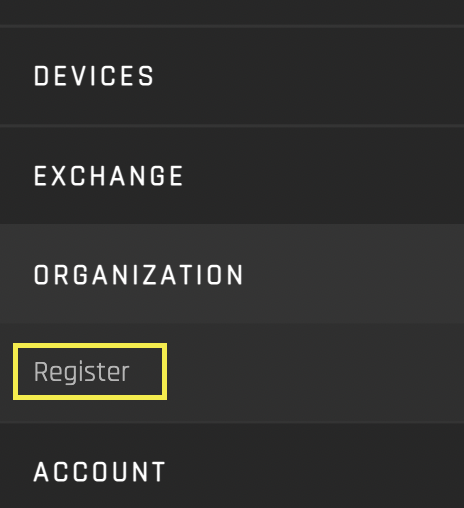 

You can view the suggested Know Your Customer (KYC) fields in the reference implementation for adding Organization Information, Authorized Signatory Information and supporting documents.   
These fields can be changed based on implementation needs.  

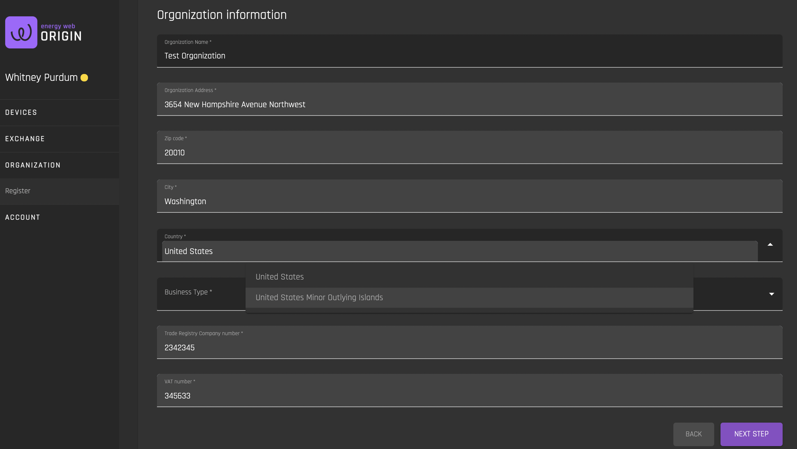

### Users  

To manage users and devices, request certificates, post supplies and demands, and claim certificates, users need to have an account in Origin. Users are associated with an [organization](#organizations). The main account of every organization is the lead user. Organizations use this account to create other user accounts and perform user management. The lead user sets permissions for all created users based on their roles in the organization. Roles and their permissions are explained [below](#user-roles). All users that are created by the organization's admin user are automatically associated to the organization and do not have to go through any additional KYC process. Users with the role of Admin or Device Manager can only be a member of one organization within the system at a time. 

Buyer organizations mostly do not require synchronization with a certificate registry (e.g. I-REC). As a result, they will not need an account in the compliance registry and Origin is the single point of truth for their user accounts. Buyers only have to register with Origin to interact with the marketplace, they do not need to register with an organization.

View how to register users [below](#registering-users).

#### User Roles
Users have one of three roles within an organization:  

1. Admin
2. Device Manager 
3. Member

##### User Role Permissions
Role Permissions for the reference implementationare as follows: 

| Roles          | Permissions                                                                                                                                                                                                                                                                                                                                                                     | Notes                                                                                                                                                                                                  |
| -------------- | ------------------------------------------------------------------------------------------------------------------------------------------------------------------------------------------------------------------------------------------------------------------------------------------------------------------------------------------------------------------------------- | ------------------------------------------------------------------------------------------------------------------------------------------------------------------------------------------------------ |
| Org admin      | <ul><li>Add and remove users to the organization</li> <li>Register the organization with the issuing body (e.g. I-REC)</li> <li>Delete the organization</li> <li>Assign the admin role to other org members</li> <li>Start and accept device change of ownership</li> <li>Perform all actions tied to the organization, organization’s certificates, and organization’s devices</li> | <ul><li>Creator of the organization automatically becomes an organizational admin</li> <li>There can be multiple org admins</li> <li>Only members of the organization can become org admins</li> </ul> |
| Device manager | <ul> <li>Register new devices and device groups</li> <li>Request certification </li> <li>Delete devices</li> </ul>                                                                                                                                                                                                                                                              | <ul><li> The device manager is also an org member and can perform all actions of an org member</li></ul>                                                                                               |
| Org Member     | <ul><li>Post bids and asks</li><li>Transfer certificates</li><li>Claim certificates</li></ul>                                                                                                                                                                                                                                                                                   | <ul><li>Can be in multiple organizations, in each organization has a different role </li></ul>          

Each role has varying access to the interfaces on the platform:

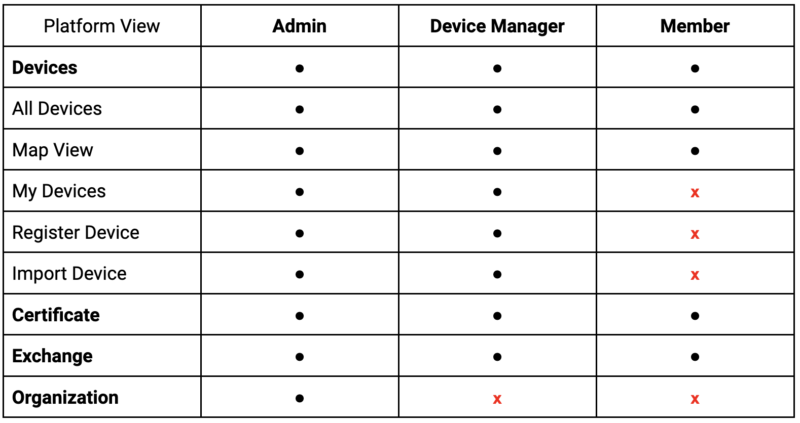

**Note that if a user creates/registers an organization, they are automatically an administrator.** Otherwise, users are given a designated role when an administrator invites them to join the organization. Read more about how to invite members [here](./organization-guides/invite.md).

#### Registering Users

To view the user registration interface, click 'Register' in the top right hand corner of the Origin interface:  

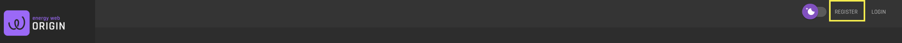  

You can view and populate the suggested Know Your Customer (KYC) fields in the reference implementation for adding User Information. __Note that these fields can change based on implementation needs__.  

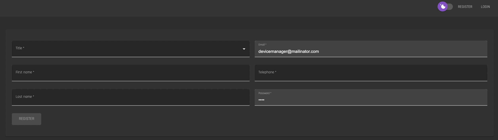

*Note that if a user is not associated with an [organization](#organizations), the user will be prompted to register an organization once their email address is confirmed:

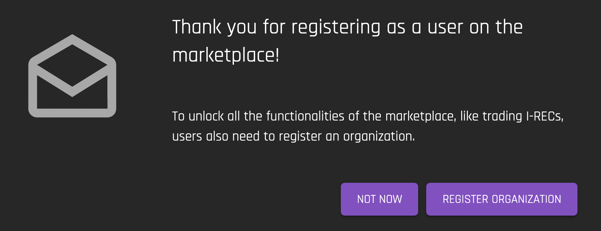

#### Inviting New Users
Admin users can invite new users to joing their organization and assign them a specific role within the organization when the invitation is created. You can learn how to invite new members [here](./organization-guides/invite.md). 

### Devices  

‘Devices’ are electricity generating assets (e.g solar pv, hydroelectric dam, steam turbine). Because [Energy Attribute Certificates](./user-guide-glossary.md#energy-attribute-certificate) are always tied to the device for which generation evidence was submitted, generation devices must be registered with Origin. The certificate inherits many characteristics from the generation device. As a result, it is essential to have certainty about which device the certificate came from and that the stated device characteristics are correct. Only allowing generation evidence from registered devices therefore facilitates traceability and prevents misconduct. If Origin is fully integrated with a certificate registry (e.g. I-REC), it relies on the registration process implemented by this registry. 

All necessary information and documents to register a device in Origin can be provided through the user interface. If Origin is integrated with a compliance registry, a registration request is automatically forwarded to the registry, where their registration process is initiated. Everything that involves the registration process of the registry, e.g. if there is a need for a on-site visit or additional documents, is handled directly between the user and the registry. Devices that are already registered with the compliance registry must to be imported into Origin (read about how to import devices [here](./device-guides/import-device.md)). Only users that are authenticated as active members of the certificate registry can import their devices. This way it is ensured that no one else can import devices and claim certificates in Origin but the verified owner of the device. 

 __You do not need to be a registered user in order to see a list of registered devices in the Origin platform, or posted supplies and demands__. You will be asked to register once you want to interact with the system further.  
 
 Read more about devices and device management in Origin [here](./device-guides/device-guide-intro.md). 
 
#### Registering Devices  
In order to register a device, the user must be registered with an existing organization and must have a user role of Admin or Device Manager. Read more about user roles and permissions [here](#user-role-permissions).

To view the device registration interface, navigate to click 'Device' on the side panel and select 'Register Device':  

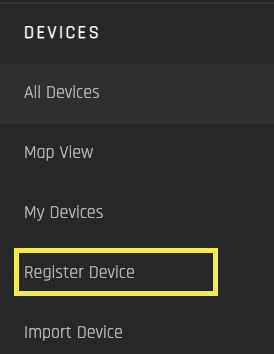

You can view the suggested device registration fields in the reference implementation for adding Device Generation Information, Device Location Information and supporting documents. These fields can be changed based on implementation needs.  

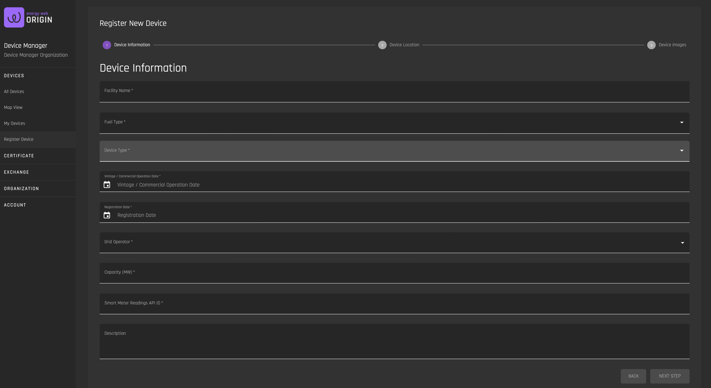

## Connecting to the Blockchain

Origin uses the Energy Web blockchain for traceability and verification of certificate ownership. Certificates are issued on the blockchain as tokens (you can read more about the certificate structure [here](https://energyweb.atlassian.net/wiki/spaces/OD/pages/883916918/Certificate+structure)).  

If your organization's users have registered devices on the Origin platform and want to be issued certifcates, sell certificates, trade certificates or retire certificates, the organization will need an Exchange Deposit address and an Organization Blockchain Account address, which are explained below. 

### Blockchain Addresses
Your blockchain addresses for the Origin Exhange are found under 'Account' in your 'User Profile':

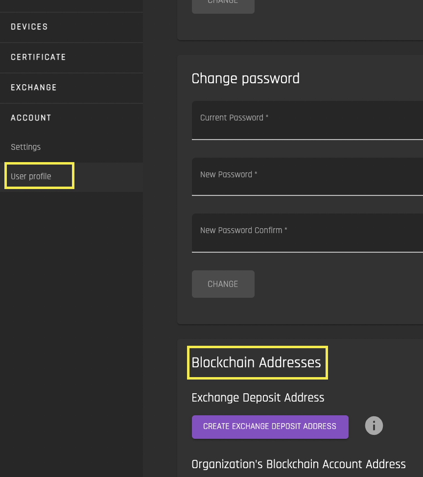

In order to connect to your Blockchain Addresses, you will need to have [MetaMask installed](https://metamask.io/). Once installed, you will need to connect to the Volta Test Network, which is the Energy Web Chain's test environment.  

You can learn more about MetaMask and how to connect to the Volta Test Network [here](https://energy-web-foundation.gitbook.io/energy-web/getting-started-with-ew-dos).    

Once you sign into MetaMask and connect to the Volta Test Network, you can click "Connect MetaMask".

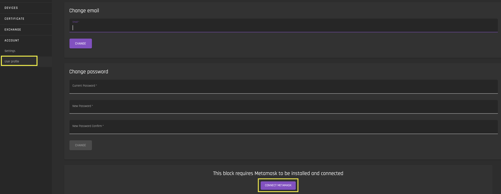

Once connected, you will see two Blockchain Addresses:

#### Exchange Deposit Address

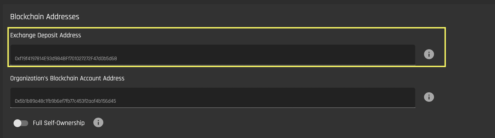

The Exchange Deposit Address is the address of your Organization's [Exchange Deposit account](./user-guide-glossary.md#energy-attribute-certificate#exchange-deposit-account). This address is auto-generated by the Origin platform for each Organization. It is used to deposit your Organization's EACs onto Exchange.

- If you are a member of an organzation that already has an Exchange Deposit Address, this address will be pre-populated after you connect to MetaMask. 
- If you are creating an organization, or you are not a member of an organization, click on 'Create Exchange Deposit Address' to have an address generated:

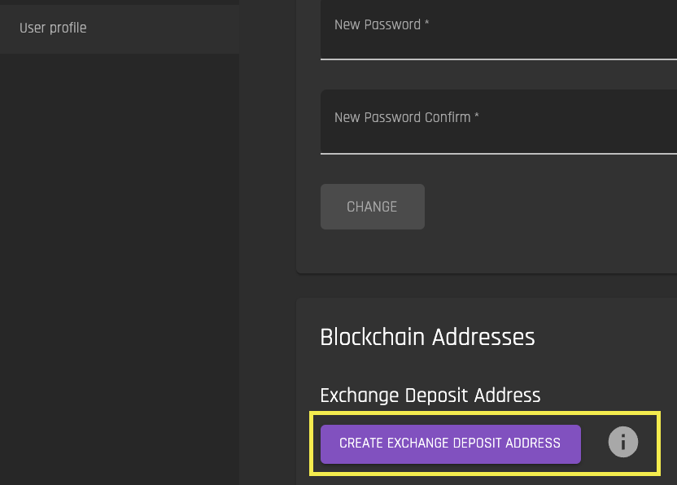

This address represents a smart contract. When a user deposits EACs onto the Exchange from their Blockchain Inbox, or when an Issuer first issues a certificate to an Organization, this smart contract forwards the EAC into the [Exchange wallet](./user-guide-glossary.md#exchange-wallet), where they are then active on the Exchange and are in the custody of the Exchange operator. You can view your Organization's certificates that are on the Exchange in the [Exchange Inbox interface](./certificate-guides/exchange-inbox.md). 

#### Organization Blockchain Account Address

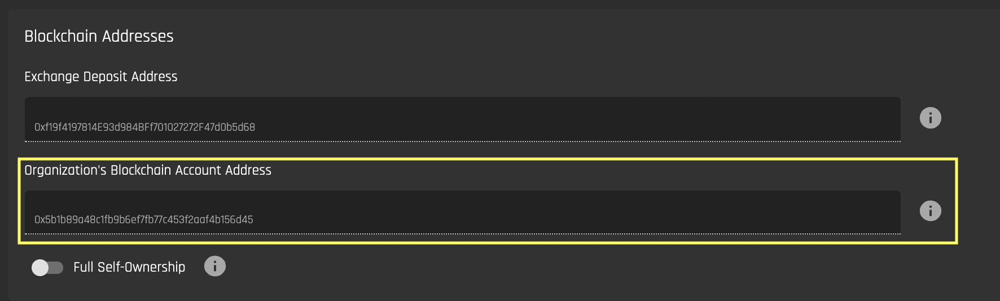

The Blockchain Account address is the public address of your Organization's Blockchain account. Unlike certificates in your Exchange Inbox, these certificates are in your custody. Certificates that are in your Blockchain account can be deposited onto the Exchange, claimed, or transferred to another Blockchain Account address. 

You can view your certificates that are in the Blockchain account in the [Blockchain Inbox interface](./certificate-guides/blockchain-inbox.md).  

The Blockchain Account Address is the MetaMask address that is used when the admin first sets up the Organization's blockchain account address. **Multiple users from the same organization can have access to this wallet address by importing the private key of this wallet into their MetaMask.** You can read the MetaMask documentation on how to import an account using a private key [here](https://metamask.zendesk.com/hc/en-us/articles/360015489331-How-to-import-an-Account).  

If you or your organization has not connected a blockchain address, select the account that you want to designate as the Blockchain Account Address in MetaMask and click "Connect Blockchain Address":

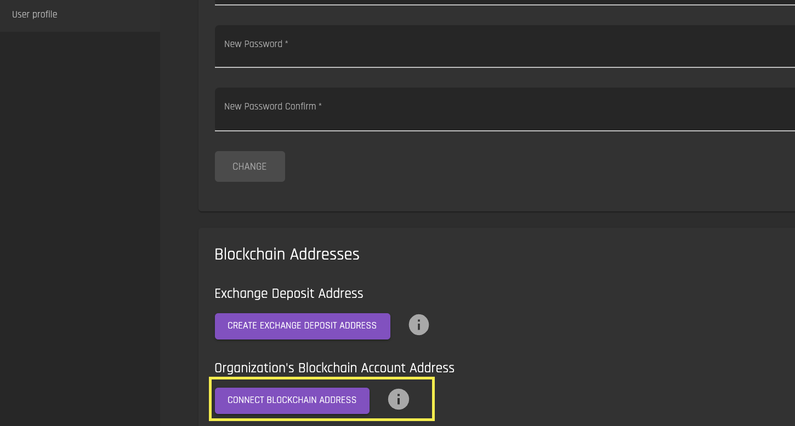

#### Full Self-Ownership

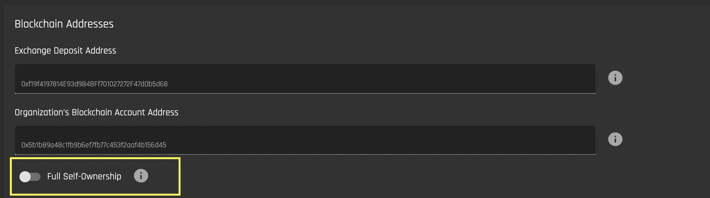 

If the 'Full Self-Ownership' toggle is selected, all issued certificates will go directly to the Organization's Blockchain Account address, and will be immediatley visible in the [Blockchain Inbox interface](./certificate-guides/blockchain-inbox.md). Users will then have to manually deposit them onto the Exchange using the ['Deposit' tab](./certificate-guides/blockchain-inbox.md#deposit). 

If the toggle is not selected, all issued certificates will go directly to the Organization's Account address, where they will be immediatley deposited onto the Exchange, and be visible in the [Exchange Inbox interface](./certificate-guides/exchange-inbox.md). This is the default behavior. 

