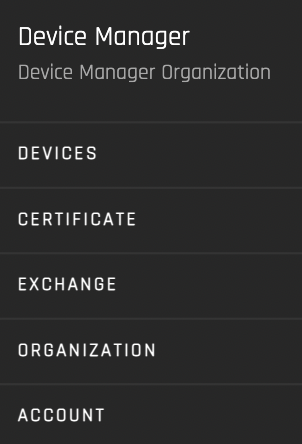

# Getting Started

The User Guides review the functionality of the Origin platform.  

You can view the source code for the reference implementation's UI on github [here](https://github.com/energywebfoundation/origin/tree/master/packages/ui). 

There is one guide for each portal of the platform:

1. [Devices](./device-guides/device-guide-intro.md): Device management and certificate requests
2. [Certificate](./certificate-guides/cert-guide-intro.md): Certificate and claims management 
3. [Exchange](./exchange-guides/exchange-guide-intro.md): Market activity and order/trade history
4. [Organization](./organization-guides/org-guide-intro.md): Organization management and I-REC API Connection
5. [Account and User Onboarding](./user-guide-reg-onboarding.md): Overview of user roles and registration

