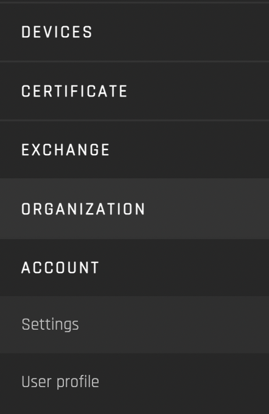

# Getting Started

The user guides cover the functionality of the Origin platform's reference implementation site (https://origin-ui-canary.herokuapp.com/).

There is one guide for each portal of the platform:

1. [Devices](./user-guide-device-management.md)
2. [Certificate](./user-guide-certificate.md)
3. [Exchange](./user-guide-exchange.md)
4. [Organization](./user-guide-organization.md)
5. [Account](./user-guide-reg-onboarding.md)

The account user guide covers user roles and priveleges. Note that user roles affect which interfaces are visible to use the user that is logged in to the platform. 

