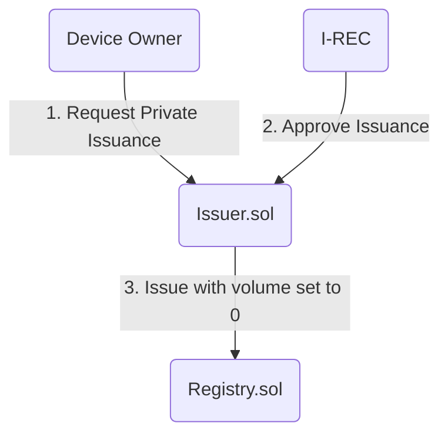
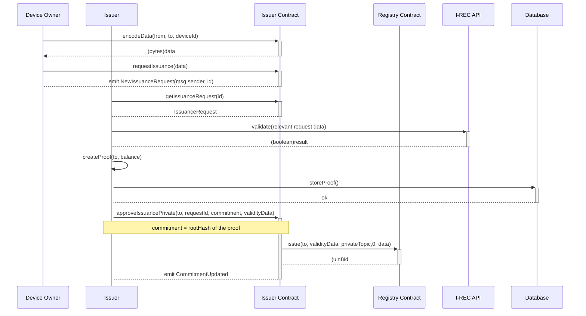
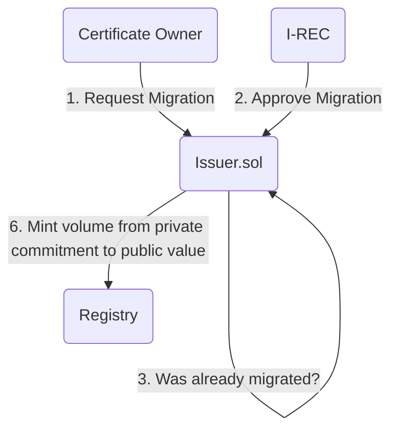
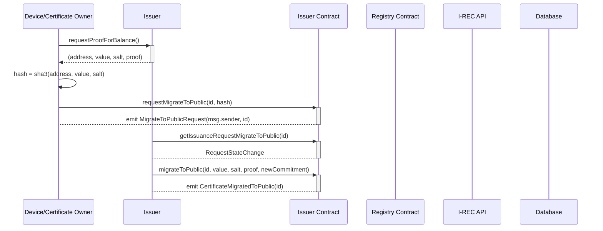
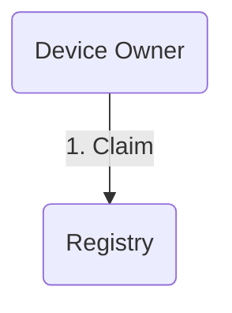
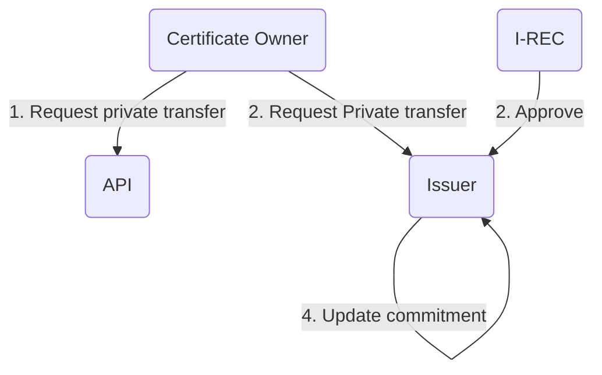
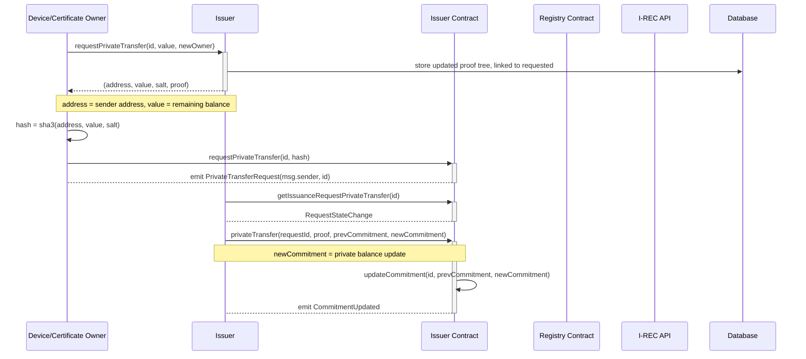

# EnergyWeb Issuer

## Registry

`Registry.sol` is ERC 1888 compatible registry for certificates issued by various issuers over various topics.

## Issuer

`Issuer.sol` is an implementation of an I-REC compliant issuer which has the option to hide the volume for newly created certificates.

### Recipes

1) Private issuance and private trading
  - issue using `requestIssuance()` with the `isPrivate` flag set to `true`
  - transfer using `approvePrivateTransfer()`

2) Private issuance and public trading
  - issue using `requestIssuance()` with the `isPrivate` flag set to `true`
  - migrate to public using `migrateToPublic()`
  - transfer / trade public volumes

### Technical documentation

1) Private requesting and issuance

---
2) Migrating certificate to public certificate

---
3) Claiming

Claiming is supported only by public issued certificates. Private certificates have to be migrated to public before being claimed.

---
4) Private transfers

This is a case where volume can be transferred privately inside the private registry. 

As an example, this can be used to transfer given volume to exchange or other account.

Notes:
`prevCommitment` is required to prevent state corruption, transition to new commitment based on other state that's currently on-chain will result in error.

Implementation:
- Certificate owner A has 1000kWh of energy on certificate id = 1 (C1)
- A requesting private transfer of 500kWh from C1 to B
  - A calls API with (id, value, newOwner) in our case (1, 500000, B)
  - if API approves the transfer (enough balance, maybe other API checks)
    - API returns (updatedBalanceOfA, salt) in our case (500000, 'randomsalt')
    - A creates onChain request where hash = hash(address, updatedBalanceOfA, salt) in our case hash(A, 5000000, salt)
    - Issuer - approves by sending new commitment that is verified against the request.hash 