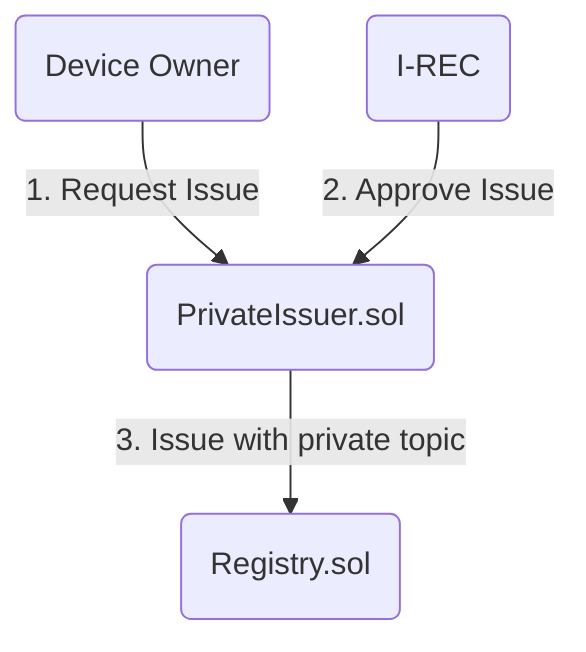
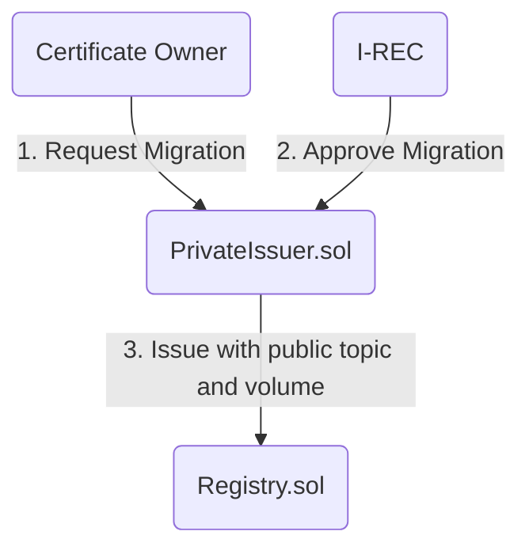
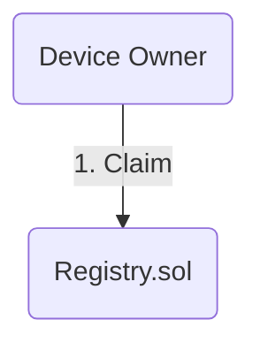

# Issuer

## Registry

`Registry.sol` is ERC 1888 compatible registry for certificates issued by various issuers over various topics.

## Issuers

`PrivateIssuer.sol` is an implementation of privacy focused issuer which hides the volume for newly created certificates until the `ERC1888` claiming event.

Migration process equals to a swap from private certificate to public certificate and is (currently) a one-way process. For certificate owner 

Issuer uses specific topic to issue:
- private certificates
- public certificates (used when migrating from private to public certificate)

### Examples

1) Requesting and issuance

2) Migrating to public certificate topic

3) Claiming

Claiming is supported only by public issued certificates. Private certificates has to be migrated to public before being claimed.

