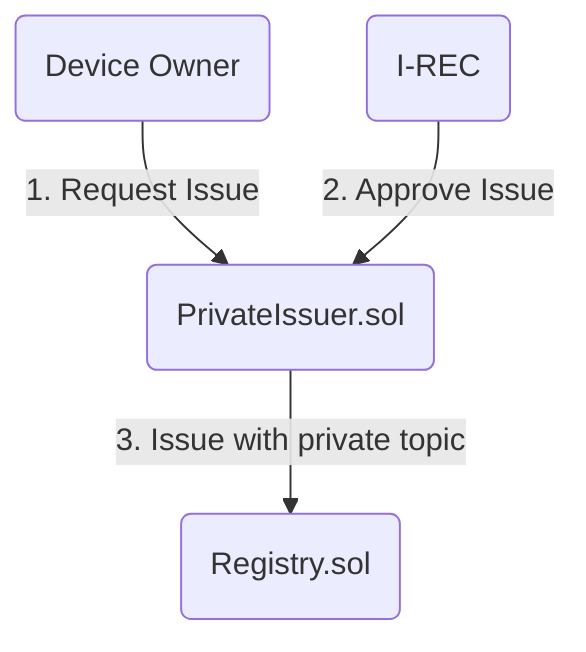
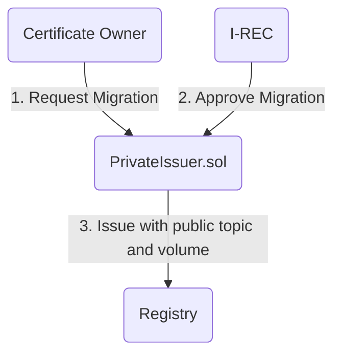
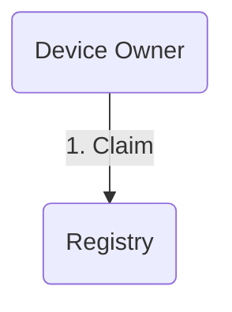
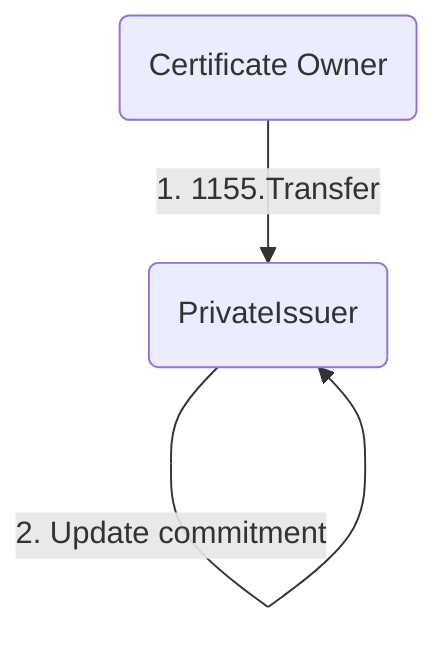
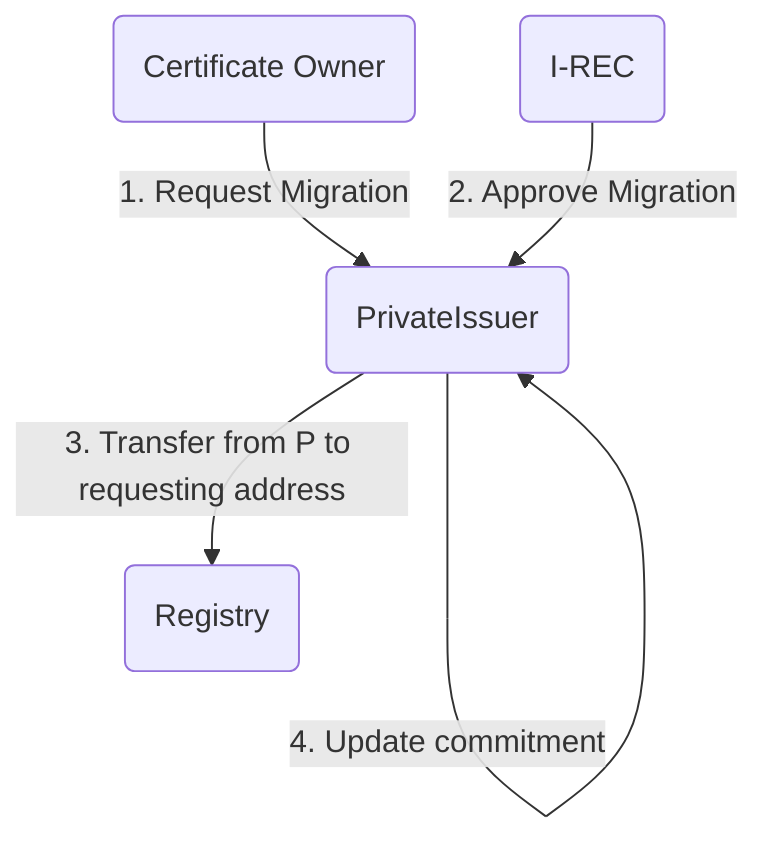

# Issuer

## Registry

`Registry.sol` is ERC 1888 compatible registry for certificates issued by various issuers over various topics.

## Issuers

`PrivateIssuer.sol` is an implementation of privacy focused issuer which hides the volume for newly created certificates until the `ERC1888` claiming event.

Migration process equals to a swap from private certificate to public certificate and is (currently) a one-way process. For certificate owner 

Issuer uses specific topic to issue:
- private certificates
- public certificates (used when migrating from private to public certificate)

### Examples

1) Requesting and issuance

2) Migrating certificate to public certificate

3) Claiming

Claiming is supported only by public issued certificates. Private certificates has to be migrated to public before being claimed.

4) Transferring from public to private

5) Migrating volume to public certificate

This is a case where private certificate was migrated to public, then part of the volume was again transferred to a private certificate.

An example is where buyer buys a public certificate but wishes to perform private trading activities before final migration to public and claiming

Note: Since `PrivateIssuer` is an owner of the token (from step 4) ) it can send publicly the request part to the requesting user. Total amount of 

