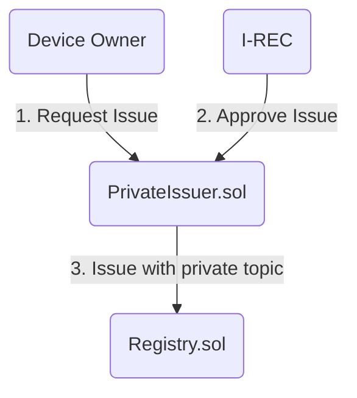
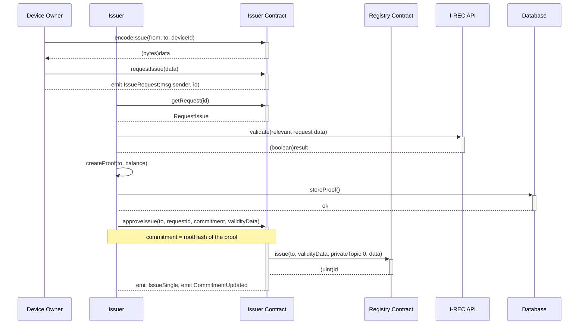
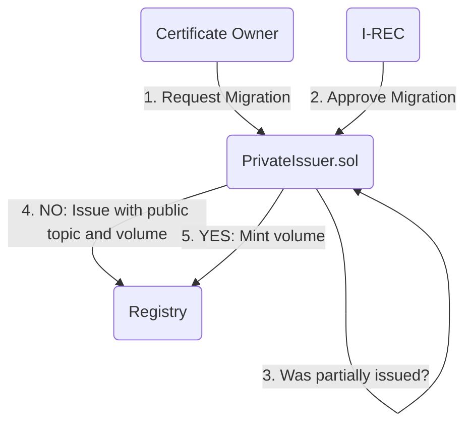
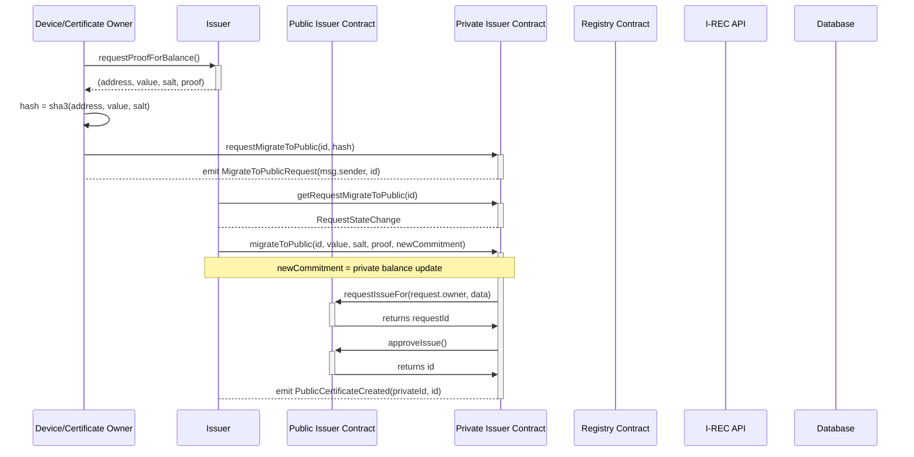
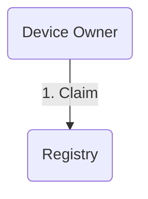
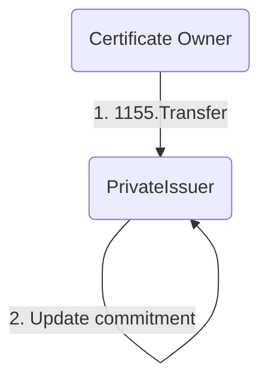
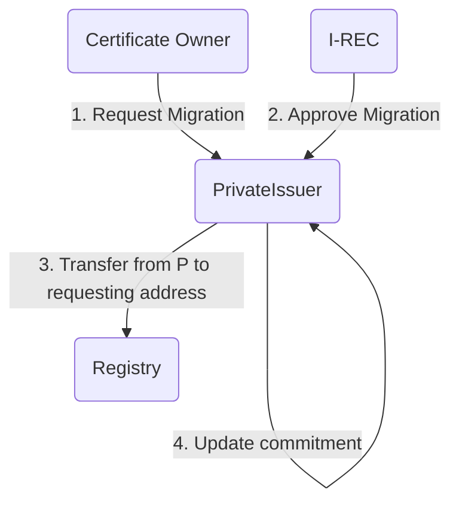
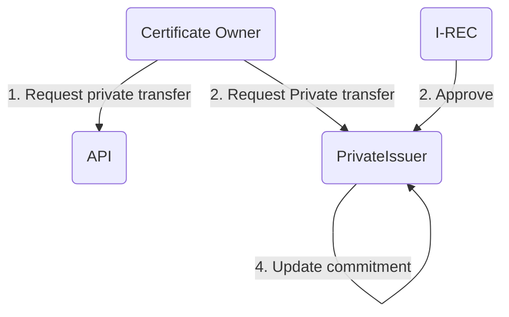
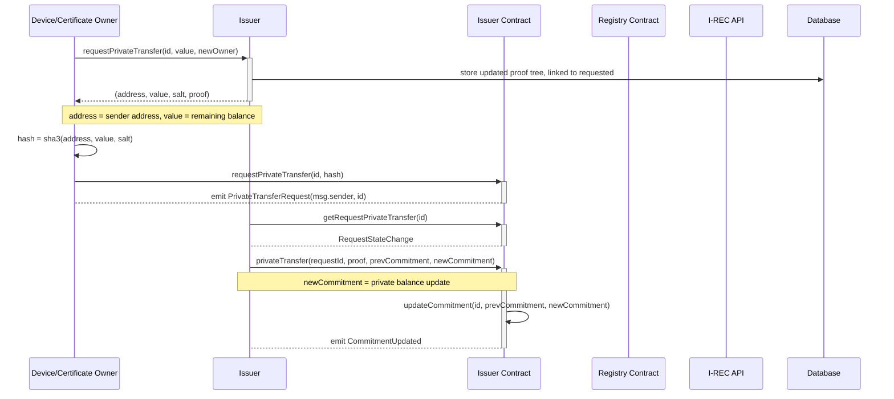

# Issuer

## Registry

`Registry.sol` is ERC 1888 compatible registry for certificates issued by various issuers over various topics.

## Issuers

1) `PrivateIssuer.sol` is an implementation of privacy focused issuer which hides the volume for newly created certificates until the `ERC1888` claiming event.

Migration process equals to a swap from private certificate to public certificate and is (currently) a one-way process. For certificate owner 

Issuer uses specific topic to issue:
- private certificates
- public certificates (used when migrating from private to public certificate)

2) `PublicIssuer.sol` is an implementation of public I-REC compliant issuer

### Recipes

1) Private issuance and private trading
  - issue using PrivateIssuer.requestIssue / PrivateIssuer.approveIssue
  - transfer using  PrivateIssuer.privateTransfer

2) Private issuance and public trading
  - issue using PrivateIssuer.requestIssue / PrivateIssuer.approveIssue
  - migrate to public using PrivateIssuer.migrateToPublic
  - transfer / trade public volumes

3) Public issuance and private trading
  - issue using PublicIssuer
  - deposit volume to PrivateIssuer
  - transfer using  PrivateIssuer.privateTransfer

### Technical documentation

1) Private requesting and issuance

2) Migrating certificate to public certificate

Note: alternatively we define a request / approve migration from private to public. So instead of private issuer calling `mint or issue` we call public issuer "issue" function, this also means that public issuer becomes a issuer address for public certificates.

3) Claiming

Claiming is supported only by public issued certificates. Private certificates has to be migrated to public before being claimed.

4) Transferring from public to private

5) Migrating volume to public certificate

This is a case where private certificate was migrated to public, then part of the volume was again transferred to a private certificate.

An example is where buyer buys a public certificate but wishes to perform private trading activities before final migration to public and claiming

Note: Since `PrivateIssuer` is an owner of the token (from step 4) ) it can send publicly the request part to the requesting user. Total amount of tokens locked to smart contract won't change. 

Note: alternatively we can implement it as burn/mint flow. Tokens deposited to PrivateIssuer contract will be burnt immediately. Then transfer from private to public will use `Migrating certificate to public certificate` flow.

6) Private transfers

This is a case where volume can be transferred privately inside the private registry. 

As an example, this can be used to transfer given volume to exchange or other account.

Notes:
`prevCommitment` is required to prevent state corruption, transition to new commitment based on other state that's currently on-chain will result in error.

Implementation:
- Certificate owner A has 1000kWh of energy on certificate id = 1 (C1)
- A requesting private transfer of 500kWh from C1 to B
  - A calls API with (id, value, newOwner) in our case (1, 500000, B)
  - if API approves the transfer (enough balance, maybe other API checks)
    - API returns (updatedBalanceOfA, salt) in our case (500000, 'randomsalt')
    - A creates onChain request where hash = hash(address, updatedBalanceOfA, salt) in our case hash(A, 5000000, salt)
    - Issuer - approves by sending new commitment that is verified against the request.hash 