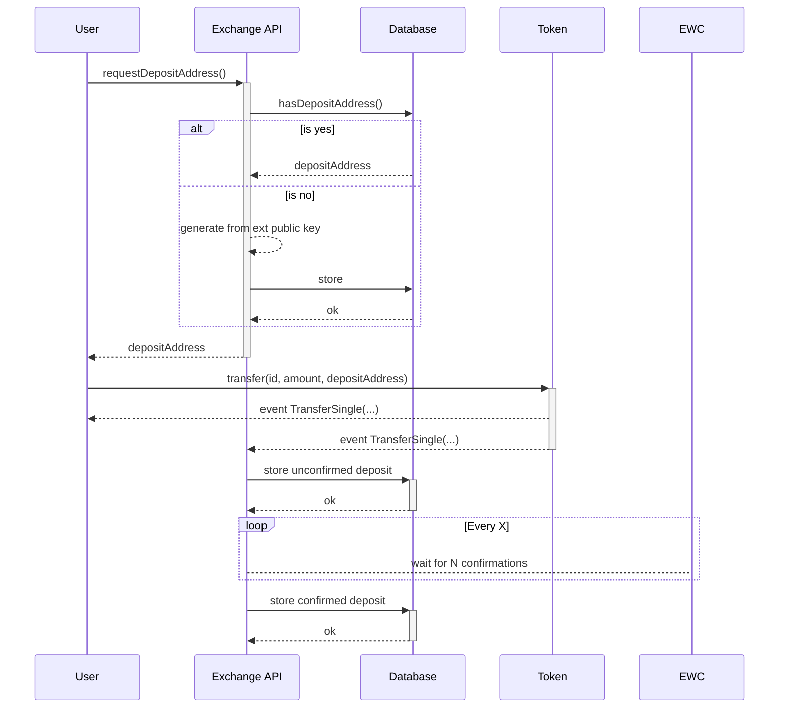

```mermaid
sequenceDiagram
  participant U as User
  participant API as Exchange API
  participant DB as Database
  participant T as Token
  participant EWC

  U->>+API: requestDepositAddress()
  API->>DB: hasDepositAddress()
  alt is yes
    DB-->>API: depositAddress 
  else is no
    API-->>API: generate from ext public key
    API->>DB: store
    DB-->>API: ok 
  end
  API-->>-U: depositAddress
  U->>+T: transfer(id, amount, depositAddress)
  T-->>U: event TransferSingle(...)
  T-->>-API: event TransferSingle(...)
  API->>+DB: store unconfirmed deposit
  DB-->>-API: ok
  loop Every X
    API-->EWC: wait for N confirmations
  end
  API->>+DB: store confirmed deposit
  DB-->>-API: ok
```