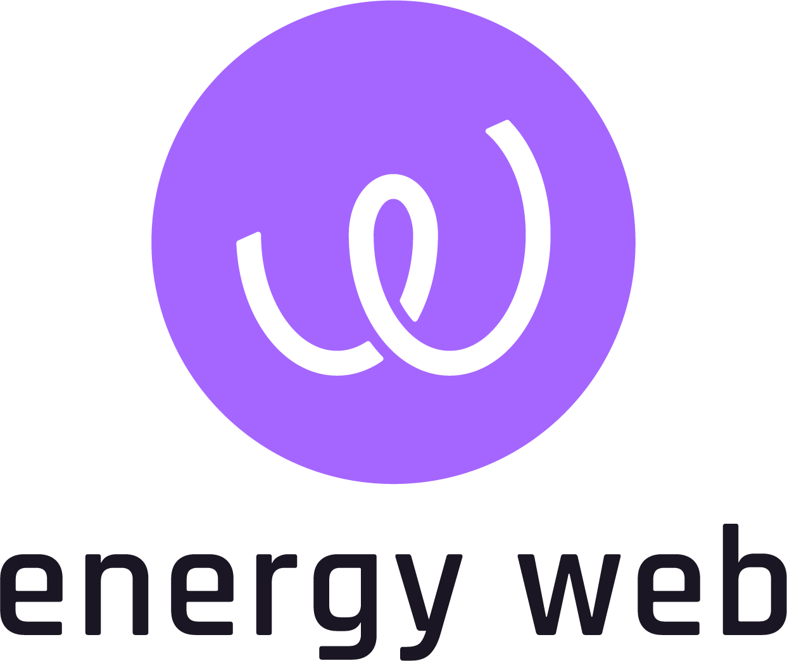

<p align="center">
  <a href="https://www.energyweb.org" target="blank"></a>
</p>

# Origin UI Certificate View

## Description

View layer implementation for the Certificate part of Origin marketplace user interface.

Origin UI Certificate View is a component of [Energy Web Origin's](https://energy-web-foundation-origin.readthedocs-hosted.com/en/latest/) SDK.

## Installation

This package is available through the npm registry.

```sh
npm install @energyweb/origin-ui-certificate-view
```

```sh
yarn add @energyweb/origin-ui-certificate-view
```

### Requirements

Before installing make sure you have all the peerDependencies installed:

```
  "react",
  "react-router",
  "react-router-dom",
  "@emotion/react",
  "emotion-theming",
  "@mui/material",
  "@mui/styles",
  "@mui/icons-material",
  "@mui/lab"alpha.59",
  "clsx",
  "react-i18next",
  "i18next",
  "dayjs",
  "react-hook-form",
  "@hookform/resolvers",
  "lodash",
  "axios",
  "yup",
  "query-string",
  "react-beautiful-dnd",
  "@react-google-maps/api",
  "react-toastify",
  "react-dropzone",
  "react-query",
  "@ethersproject/providers",
  "@ethersproject/address"
  "@ethersproject/bignumber",
  "@ethersproject/units",
  "@energyweb/utils-general",
  "@energyweb/origin-backend-core",
  "@energyweb/issuer",
  "@energyweb/issuer-irec-api-react-query-client",
  "@energyweb/origin-device-registry-api-react-query-client",
  "@energyweb/origin-device-registry-irec-local-api-react-query-client",
  "@energyweb/exchange-react-query-client",
  "@energyweb/origin-backend-react-query-client",
  "@energyweb/exchange-irec-react-query-client",
  "@energyweb/origin-organization-irec-api-react-query-client",
  "@energyweb/origin-ui-core",
  "@energyweb/origin-ui-utils",
  "@energyweb/origin-ui-assets",
  "@energyweb/origin-ui-web3",
  "@energyweb/origin-ui-theme",
  "@energyweb/origin-ui-shared-state",
  "@energyweb/origin-ui-localization",
  "@energyweb/origin-ui-certificate-logic",
  "@energyweb/origin-ui-certificate-data",
```

### Usage

- To use the default setup simply connect Certificate UI app to your routing an pass required env variables and routes configuration:

```JSX
import { Routes, Route } from 'react-router-dom';
import { CertificateApp } from '@energyweb/origin-ui-certificate-view';

export const App = () => {
  return (
    <Routes>
      <Route
          path="certificate/*"
          element={
              <CertificateApp
                routesConfig={certificateRoutes}
                envVariables={{
                  allowedChainIds: [1,2,3],
                  googleMapsApiKey: 'API_KEY',
                  exchangeWalletPublicKey: '0x0000000',
                }}
              />
          }
        />
    </Routes>
  )
}
```

- To remove certain pages, add you own custom page - you have to re-configure the Certificate UI app and use your own custom instance:

```JSX
import { PageNotFound } from '@energyweb/origin-ui-core';
import React, { FC } from 'react';
import { Route, Routes } from 'react-router-dom';
import {
  CertificateModalsCenter,

  CertificateAppEnvProvider,
  CertificateEnvVariables,
  CertificateModalsProvider,
  TransactionPendingProvider,

  ApprovedPage,
  BlockchainInboxPage,
  CertificatesImportPage,
  ClaimsReportPage,
  DetailViewPage,
  ExchangeInboxPage,
  PendingPage,
  RequestsPage,
} from '@energyweb/origin-ui-certificate-view';
// using local folder
import { CustomPage } from './components';

export interface CertificateAppProps {
  envVariables: CertificateEnvVariables;
}

export const CertificateApp: FC<CertificateAppProps> = ({ envVariables }) => {
return (
  // Certain pages consume env variable from this context
  // so make sure you only extend it, not edit
    <CertificateAppEnvProvider variables={envVariables}>
    // Some page trigger modal opens using this context
      <CertificateModalsProvider>
        <Routes>
          <Route
            path="exchange-inbox"
            element={
              <TransactionPendingProvider>
                <ExchangeInboxPage />
              </TransactionPendingProvider>
            }
          />
          <Route
            path="blockchain-inbox"
            element={
              <TransactionPendingProvider>
                <BlockchainInboxPage />
              </TransactionPendingProvider>
            }
          />
          <Route path="claims-report" element={<ClaimsReportPage />} />
          <Route path="requests" element={<RequestsPage />} />
          <Route path="pending" element={<PendingPage />} />
          <Route path="approved" element={<ApprovedPage />} />
          // This page now won't appear on our app
          // <Route path="import" element={<CertificatesImportPage />} />

          // This will add a new page to Certificate UI app
          <Route path="custom-page" element={<CustomPage />} />

          <Route path="detail-view/:id" element={<DetailViewPage />} />
          <Route path="*" element={<PageNotFound />} />
        </Routes>
        <CertificateModalsCenter />
      </CertificateModalsProvider>
    </CertificateAppEnvProvider>
  );
};

```

## Contributing Guidelines

See [contributing.md](../../../../../contributing.md)

# Energy Web Decentralized Operating System

EW-Origin is a component of the Energy Web Decentralized Operating System (EW-DOS).

The purpose of EW-DOS is to develop and deploy an open and decentralized digital operating system for the energy sector in support of a low-carbon, customer-centric energy future.

We develop blockchain technology, full-stack applications and middleware packages that facilitate participation of Distributed Energy Resources on the grid and create open market places for transparent and efficient renewable energy trading.

- To learn about more about the EW-DOS tech stack, see our [documentation](https://app.gitbook.com/@energy-web-foundation/s/energy-web/)

For a deep-dive into the motivation and methodology behind our technical solutions, read our White Papers:

- [Energy Web White Paper on Vision and Purpose](https://www.energyweb.org/reports/EWDOS-Vision-Purpose/)
- [Energy Web White Paper on Technology Detail](https://www.energyweb.org/wp-content/uploads/2020/06/EnergyWeb-EWDOS-PART2-TechnologyDetail-202006-vFinal.pdf)

## Connect with Energy Web

- [Twitter](https://twitter.com/energywebx)
- [Discord](https://discord.com/channels/706103009205288990/843970822254362664)
- [Telegram](https://t.me/energyweb)

## License

This project is licensed under the MIT License - see the [LICENSE](LICENSE) file for details
